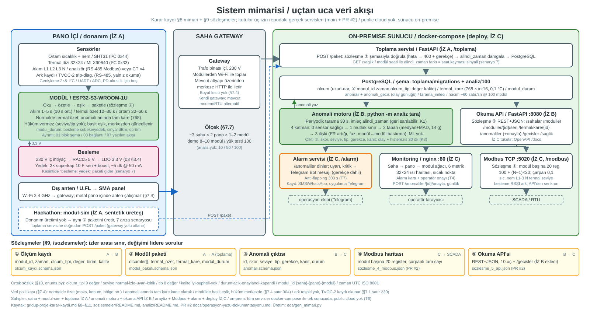
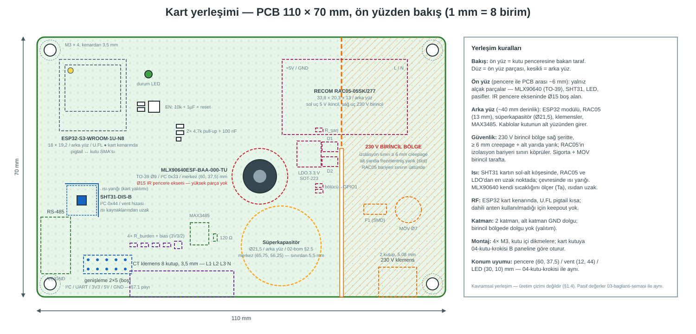
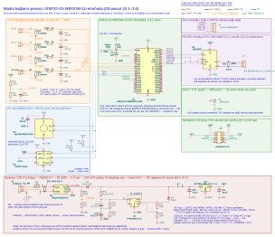

# Grid-Up — Pano İçi Anomali Erken Uyarı Sistemi

**ADM & GDZ Elektrik — Grid Up Hackathon (2026)**  
*OG Hücreleri ve AG Dağıtım Panolarında Çok Kanallı Durum İzleme ve Uçtan Uca Anomali Erken Uyarı Platformu*

---

## 📌 Proje Özeti

Elektrik dağıtım şebekesindeki orta gerilim (OG) hücreleri ve alçak gerilim (AG) panolarında meydana gelen yangın, ekipman hasarı ve enerji kesintilerinin büyük bölümü (gevşek klemens, aşırı yük, faz dengesizliği, yoğuşma, yalıtım kaybı); **kritik arıza gerçekleşmeden önce ısınma, nem artışı ve akım dengesizlikleriyle sinyal verir.**

**Grid-Up**, pano içine yerleştirilen endüstriyel sınıf sensör modülü tasarımıyla başlayıp, saha gateway'i üzerinden şirket içi (**on-premise**) sunucuya ulaşan, çok katmanlı istatistiksel anomali tespit motoruyla arızayı kök nedeninde yakalayan ve operatörlere **SCADA (Modbus TCP)**, **Web İzleme Arayüzü** ile yerel ağdaki **Android SMS Gateway** üzerinden SMS bildirimi ileten uçtan uca, çalışan bir erken uyarı sistemidir.

> **Önemli Kısıtlar & Mimari İlkeler:**
> 1. **%100 On-Premise:** Şartname gereği **Public Cloud (AWS, Azure, GCP vb.) kesinlikle kullanılmamıştır.** Tüm veri saklama, analiz, arayüz ve alarm servisleri yerel ağda tek bir `docker-compose` komutuyla izole çalışır.
> 2. **Endüstriyel Donanım Tasarımı:** Şartname uyarınca fiziksel satın alma ve pano montajı yapılmamış; ancak TEDAŞ-MLZ/2003-06.B şartnamesine tabi **1600 kVA AG Dağıtım Panosu** referans alınarak −40…+85 °C endüstriyel sınıf bileşenlerle eksiksiz CAD (Fusion 360) ve EDA (KiCad) tasarım dokümantasyonu üretilmiştir.
> 3. **Gerçekçi Yazılım & Sentetik Veri:** Donanım üretilmediği için veri sentetik üreteçle fizik kurallarına uygun simüle edilmiş; yazılım tarafının tamamı (veri toplama, veritabanı, anomali motoru, REST API, Modbus TCP, alarm servisi, frontend) **gerçek ve çalışır durumdadır.**

---

## 🏛️ Uçtan Uca Sistem Mimarisi

Sistem, fiziksel pano içi donanımdan merkezi operasyon yüzüne kadar birbirine sıkı sözleşmelerle bağlı 3 ana katmandan oluşur:

```
┌──────────────────────── PANO İÇİ ─────────────────────────┐
│                                                           │
│  Sensörler: SHT31 (Sıcaklık/Nem) + MLX90640 (Termal Dizi) │
│  Akım: Enerji Analizörü (Modbus) veya Split-core CT ×4    │
│  Ark: ABB TVOC-2 (RS-485 Modbus Okuma)                    │
│                                │                          │
│                                ▼                          │
│               [ MODÜL: ESP32-S3-WROOM-1U-N8 ]             │
│               (230V İç İhtiyaç + Süperkapasitör)          │
│                                │                          │
│                                ▼                          │
│               Dış Anten (Panel SMA / 2.4 GHz)             │
└────────────────────────────────┼──────────────────────────┘
                                 │ Kablosuz (Wi-Fi)
                      ┌──────────▼──────────┐
                      │    SAHA GATEWAY     │ (Trafo binası içi, 230V)
                      └──────────┬──────────┘
                                 │ Mevcut Saha Altyapısı (HTTP)
        ═════════════════ ON-PREMISE SUNUCU ═════════════════
        │                                                   │
        │  ① Toplama Servisi (FastAPI :8000) ──► PostgreSQL │
        │                                            │      │
        │  ② Anomali Motoru (4 Katmanlı Medyan+MAD) ◄┘      │
        │         │                                         │
        │         ├──► ③ Okuma API'si (FastAPI :8080)       │
        │         │           │                             │
        │         │           ├─► ④ Web İzleme UI (nginx:80)│
        │         │           └─► ⑤ Modbus TCP (:5020/SCADA)│
        │         │                                         │
        │         └──► ⑥ Alarm Servisi                      │
        │                 ├─► Android SMS Gateway (LAN)     │
        │                 └─► Telegram (seçmeli, kapalı)    │
        ═════════════════════════════════════════════════════
```



*Pano içi modülden saha gateway'ine, merkezi veritabanından analiz motoru, SCADA, web izleme arayüzü ve alarm servisine uçtan uca sistem mimarisi.*

---

## 📋 Teslimat Kalemleri Matrisi (T1 – T7)

Yarışma şartnamesindeki tüm teslimat kalemleri projemizde eksiksiz karşılanmıştır:

| Kod | Kalem | Karşılığı Olan Çıktılar & Konum |
|---|---|---|
| **T1** | **Kabin İçi Modül / Prototip Tasarımı** | [`docs/track-a/01-blok-sema.md`](docs/track-a/01-blok-sema.md) · [`02-bom.md`](docs/track-a/02-bom.md) · [`04-mekanik-yerlesim.md`](docs/track-a/04-mekanik-yerlesim.md) · [`06-montaj-proseduru.md`](docs/track-a/06-montaj-proseduru.md) · CAD Modelleri ([`cad/`](docs/track-a/cad/)) |
| **T2** | **Elektronik Tasarım Dokümantasyonu** | [`docs/track-a/03-pinout.md`](docs/track-a/03-pinout.md) · [`03-baglanti-semasi.svg`](docs/track-a/03-baglanti-semasi.svg) · KiCad EDA Projesi ([`eda/`](docs/track-a/eda/)) · [`02-pcb-yerlesimi.svg`](docs/track-a/02-pcb-yerlesimi.svg) |
| **T3** | **Yazılım Mimarisi** | [`docs/track-a/07-yazilim-akis.md`](docs/track-a/07-yazilim-akis.md) · [`08-sistem-mimarisi.svg`](docs/track-a/08-sistem-mimarisi.svg) · [`firmware/`](firmware/) · [`modul-sim/`](modul-sim/) · [`analiz/`](analiz/) · [`arayuz/`](arayuz/) |
| **T4** | **Monitoring (İzleme) Platformu** | [`arayuz/`](arayuz/) (Nginx üzerinde Web Dashboard, Isı Haritası, Canlı Metrikler) · [`modbus/`](modbus/) (SCADA Modbus TCP Sunucusu) |
| **T5** | **Ölçeklenebilirlik & Kaynak Kullanımı** | [`analiz/`](analiz/) (100 modül eşzamanlı ingest ve anomali tarama testi, kaynak tüketim raporu) · [`modul-sim`](modul-sim/) (`--modul 100`) |
| **T6** | **On-Premise / Özel Altyapı** | [`deploy/docker-compose.yml`](deploy/docker-compose.yml) (Public Cloud bağımsızlığı, tek komutla yerel orkestrasyon) |
| **T7** | **Alarm ve Acil Bildirim Mekanizması** | [`alarm/`](alarm/) (Android SMS Gateway yerel sunucu kipi, olay bazlı tekrar önleme, bekleyen kuyruğu ve kalıcı durum; Telegram bulut hizmeti olduğu için varsayılan kuralda yok — bkz. `alarm/README.md`) |

---

## 📐 Donanım Tasarımı Görselleri (T1 – T2)



*ESP32-S3, MLX90640 termal dizi, SHT31, RAC05 güç modülü ve süperkapasitör içeren 110 × 70 mm iki katmanlı modül PCB yerleşimi.*



*Besleme, I²C sensör hattı, RS-485 Modbus arayüzü ve anten bağlantı şeması.*

---

## 🗂️ Repo Düzeni ve Katmanlar (İş İzleri)

Takım çalışması ve sözleşme sınırları 3 bağımsız iş izine bölünmüştür:

```
├── sozlesmeler/               # İzler arası ortak sözleşmeler (JSON şemaları ve Enum sözlüğü)
├── gridup-proje-karar-kaydi.md# Projenin tek referans üst karar kaydı
├── entegrasyon-gorev-dagilimi.md# Sistem entegrasyonu görev ve kabul kriterleri
│
├── docs/                      # Jüriye sunulan nihai teknik dokümanlar
│   ├── track-a/               # İZ A: T1 & T2 donanım, mekanik, şema ve montaj dokümanları (01–09)
│   │   ├── cad/               # Fusion 360 modelleri (.f3d, .step) ve projeksiyon script'leri
│   │   └── eda/               # KiCad 10 şematiği (.kicad_sch), netlist ve sembol kütüphaneleri
│   ├── izb-karar-kaydi.md     # İZ B: Analiz katmanı ve dedektör mimarisi karar kaydı
│   └── operasyon-yuzu-dokumantasyonu.md # İZ C: Arayüz, alarm ve Modbus mimari dokümanı
│
├── modul-sim/                 # İZ A: 7 arıza senaryolu sentetik veri üreteci ve modül mantığı
├── toplama/                   # İZ A: FastAPI veri toplama servisi (:8000) ve PostgreSQL migrasyonları
├── firmware/                  # İZ A: ESP32-S3 sembolik firmware iskeleti (PlatformIO/C++)
│
├── analiz/                    # İZ B: İstatistiksel anomali tespit motoru, kör test ve Okuma API'si (:8080)
│
├── arayuz/                    # İZ C: Web tabanlı SCADA/Monitoring arayüzü (HTML5/Vanilla JS/Nginx :80)
├── modbus/                    # İZ C: SCADA entegrasyonu için Modbus TCP sunucusu (:5020)
├── alarm/                     # İZ C: Dayanıklı alarm dağıtım servisi (Android SMS Gateway, LAN)
└── deploy/                    # İZ C: On-Premise Docker Compose dağıtım yapılandırması
```

---

## 🚀 Hızlı Başlangıç (Tek Komutla Çalıştırma)

Tüm sistemi şirket içi (on-premise) ortamda ayağa kaldırmak için:

### 1. Ön Koşullar
- Docker ve Docker Compose (`docker compose version` ≥ 2.20)
- Python 3.11+ (Geliştirme ve birim testler için)

### 2. Tek Komutla Başlatma
```bash
# (İsteğe bağlı) SMS gateway adresi/kimlik bilgileri için ortam dosyası;
# yoksa da yığın kalkar, kritik alarmlar teslim edilene kadar kuyrukta bekler
cp deploy/.env.example deploy/.env

# Tüm servisleri arka planda ayağa kaldırın
docker compose -f deploy/docker-compose.yml up -d
```

### 3. Canlı Servis Portları ve Erişim

| Servis | Adres / Port | Açıklama |
|---|---|---|
| **Monitoring Dashboard** | `http://localhost:80` | Web arayüzü (Pano hiyerarşisi, canlı grafikler, termal ısı haritası) |
| **Toplama (Ingest) API** | `http://localhost:8000` | Gateway/Modül veri alım uç noktası (`POST /paket`, `GET /saglik`) |
| **Okuma API'si (Analiz)** | `http://localhost:8080` | İz B REST API (`/sahalar`, `/moduller`, `/anomaliler`, Swagger `/docs`) |
| **Modbus TCP Sunucusu** | `localhost:5020` | SCADA/RTU PLC entegrasyonu için Sözleşme ④ register haritası |
| **PostgreSQL Veritabanı** | `veritabani:5432` *(Docker ağı içi)* | Merkezi zaman serisi ve anomali deposu (güvenlik için dış host portu kapalıdır) |

### 4. Duman Testini Koşturma
Servislerin birbirleriyle uçtan uca haberleştiğini doğrulamak için:
```bash
python duman_testi_kosturucu.py
```

---

## 📡 Sözleşmeler ve Ortak Sözlükler

İzler arasındaki sınır ve entegrasyon `/sozlesmeler` altındaki standartlarla korunur:

- **① Ölçüm Kaydı (`olcum_kaydi.schema.json`):** Uzun-dar formatta zaman serisi ölçüm satırı (`modul_id, zaman, olcum_tipi, deger, kalite`).
- **② Modül Paketi (`modul_paketi.schema.json`):** Gateway'den sunucuya iletilen paket (`olcumler, termal_ozet, termal_kare, modul_durum`).
- **③ Anomali Çıktısı (`anomali.schema.json`):** Anomali motorunun tespit kaydı (`id, modul_id, skor, seviye, tip, gerekce, kanit, durum`).
- **④ Modbus Register Haritası (`sozlesme_4_modbus.json`):** Modül başına 20 register ayrılmış, SCADA uyumlu tamsayı haritası.
- **⑤ Okuma API'si:** İz C'nin İz B'den veri çektiği standart REST+JSON arayüzü.

### Simüle Edilen 7 Arıza Senaryosu
1. **Gevşek Klemens:** Akım sabitken tek noktada (klemens) temas direnci artışı ve aşırı ısınma.
2. **Aşırı Yük:** Tüm faz akımlarının anma değerini aşması ve genel kabin sıcaklığının yükselmesi.
3. **Faz Dengesizliği:** Faz akımları arasındaki dengesizlik ve nötr hattından akım akması.
4. **Nem Yükselmesi:** Pano içi bağıl nemin artması ve çiğ noktası yaklaşımıyla yoğuşma/yalıtım riski.
5. **Ark Olayı:** Optik ark koruma rölesinden (ABB TVOC-2) tetiklenme sinyalinin yakalanması.
6. **Sensör Arızası:** Ölçümün donması veya geçersiz değerler üretmesi (`kalite: supheli/yok`).
7. **Modül Sağlığı:** Şebeke enerjisi kesintisi (`besleme: yedek`), RF sinyal zayıflığı ve saat kayması.

---

## 🧪 Testler ve Doğrulama

Projeye dahil tüm bileşenler kapsamlı otomatik testlerle donatılmıştır:

```bash
# Şema ve sözleşme tutarlılık denetimi
python3 sozlesmeler/dogrula.py

# İZ A modül simülatörü ve toplama servisi testleri
pytest modul-sim/tests/ toplama/tests/

# İZ B anomali motoru ve kör test doğrulayıcı testleri
pytest analiz/tests/

# İZ C alarm servisi, Modbus sunucusu ve web arayüz sözleşme testleri
cd alarm && python3 -m unittest test && cd ..
python3 modbus/test_modbus_service.py
npm test --prefix arayuz                    # sözleşme + kabul testleri, node:test
sh arayuz/dogrulama/docker_dogrula.sh       # imaj + Nginx vekil yolu (Docker gerekir)

# Donanım EDA şematik bağlantı (netlist) doğrulaması ve mimari üreteci
python3 docs/track-a/eda/verify_netlist.py docs/track-a/eda/GridUp-Modul.net
python3 docs/track-a/eda/gen_mimari.py
```

---

## 👥 Takım (LogiAI Marmara)

- **Efe Özan (thozoz):** İZ A — Veri Yolu, Donanım Tasarım Dokümantasyonu, Sentetik Veri Simülatörü, Toplama Servisi.
- **İsmail Efe (ism00efe):** İZ B — Analiz Katmanı, İstatistiksel Anomali Motoru, Okuma API'si, Ölçeklenebilirlik Testi.
- **Onur Demir (onurdemir123456):** İZ C — Operasyon Yüzü, Web İzleme Arayüzü, Modbus TCP Sunucusu, Alarm Servisi, On-Prem Kompozisyon.

---
*Proje lisansı: [Apache License 2.0](LICENSE)*
