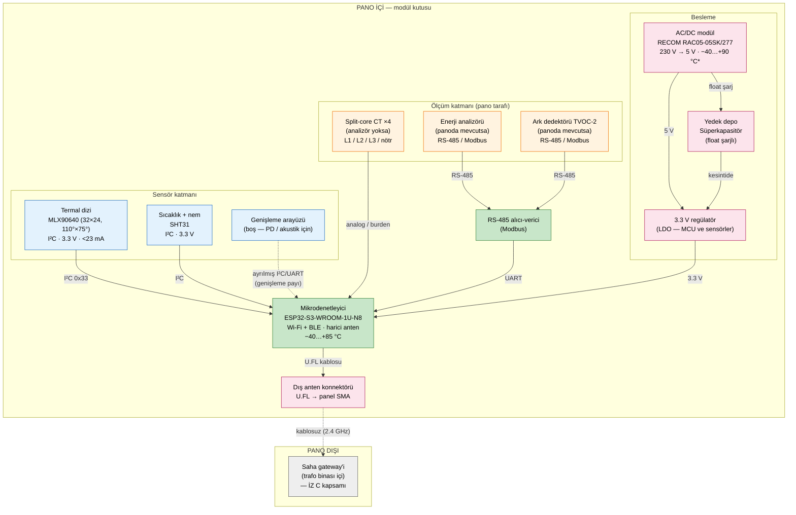

# 1. Modül Blok Şeması

**Teslimat karşılığı:** T1 (kabin içi modül tasarımı) · T2 (elektronik tasarım dokümantasyonu)
**Dayandığı kararlar:** §7.1 ölçüm kümesi · §7.3 besleme · §7.4 haberleşme
**Bağlayıcı şart:** Genişleme payı ifadesi — §7.1 satır 237

---

## 1.1 Blok şema

> **Şemanın metin hali:** panonun içindeki modül kutusunda termal dizi ve sıcaklık/nem sensörü
> doğrudan mikrodenetleyiciye I²C ile bağlıdır. Akım ve ark verisi ya panoda bulunan enerji
> analizörü ve TVOC-2'den RS-485/Modbus ile, ya da analizör yoksa split-core CT'lerden analog
> olarak alınır. Mikrodenetleyici veriyi işler ve panonun dışına çıkarılan anten üzerinden saha
> gateway'ine gönderir. Modül, 230 V iç ihtiyaç devresinden beslenir; süperkapasitör float
> durumda şarjlı bekler ve yalnızca besleme kesildiğinde devreye girer.

> **\\* AC/DC modülün sıcaklık sınıfı — dipnot.** Datasheet 5 V çıkış için **tam yükte
> −40…+75 °C** verir; **+90 °C** yalnız **derating grafiğiyle** (düşük yükte) ulaşılır. Modülümüzün
> çekişi 5 W anma gücünün ~%15–40'ı olduğundan derating eğrisinde +85…+90 °C bölgesi
> kullanılabilir — şartname karşılanır. Bkz. [KAYNAKÇA.md §1.5](KAYNAKCA.md).

---

## 1.2 Blok blok gerekçeler

### Termal dizi — MLX90640 (32×24, 110°×75°)

**Ne yapar:** 768 pikselden aynı anda yüzey sıcaklığı okur. Fotoğraf değil, sıcaklık matrisi üretir.

**Neden bu ölçüm kritik:** Ortam sıcaklığı *"kabin ısındı"* der; termal dizi *"7 numaralı klemens
ısındı"* der. En yaygın arıza nedeni olan gevşek klemensi **nokta bazında** yakalayan tek ölçüm
budur ve projenin erken uyarı iddiasını gerçek kılan ölçüm budur (§7.1 satır 227).

**Neden 110°×75°:** Modül kapağa takılıp klemenslere **377 mm** (montaj plakası) / **155,5 mm** (NH
ayırıcı ön yüzü) mesafeden bakar; bu mesafelerde kapsama **1077 × 579 mm** ve **444 × 239 mm** olur
(§7.1 satır 232 kayıt hesaplamasını *"~40 cm, kabaca 114 × 61 cm"* diye yaklaşık vermişti; gerçek
model bunu kesinleştirdi — ayrıntı [4. doküman §4.3](04-mekanik-yerlesim.md)). Geniş açı, tan
hesabıyla 110°×75°'ye denk gelir. Dar açılı (55°×35°) varyant aynı mesafeden yalnızca ~39 × 24 cm
görür ve klemens sırasını hiç kapsamaz.

**Piksel ölçeği:** 377 mm'de piksel başına yaklaşık **3,4 × 2,4 cm**, 155,5 mm'de **1,4 × 1,0 cm**
düşer. Klemens adımı ~20–25 mm olduğundan, NH düzlemindeki piksel her klemensi kendi pikselinde
görür — *"gevşek klemensi nokta bazında yakala"* iddiasının dayanağı budur.

**Duyarlılık:** NETD 0,1 K RMS @1 Hz (komşu noktalar arasındaki 0,1 °C farkı ayırt eder). Mutlak
doğruluk ±1–2 °C'dir. Tespit için önemli olan **çözünürlük ve göreli fark**tır; *"bu klemens
komşularından 15 °C daha sıcak"* demek yeterlidir.

**⚠️ Bilinen sınırlama — yayma katsayısı (emissivity):** Kızılötesi ölçüm yüzeyin yayma katsayısına
bağlıdır. Cilalı bakırın yayma katsayısı çok düşüktür (~0,03), buna karşılık elektrik klemensleri
yaklaşık 0,60'tır. Bu nedenle **cilalı bakır baraların yüzey sıcaklığı bu yöntemle güvenilir
ölçülemez**; modül, yayma katsayısı uygun olan **klemens bağlantı noktalarını** hedefler ki bu
zaten projenin asıl hedef bölgesidir. Yayma katsayısı sensörün EEPROM'unda tutulmaz, yazılımda
belirtilir (Melexis datasheet §11.2.2.5.4).

### Sıcaklık ve nem — SHT31

**Ne yapar:** Kabin içi havanın sıcaklığını ve bağıl nemini ölçer.

**Neden gerekli:**
- **Referans çizgisi:** Kabinin ısınmasının anormal olup olmadığı ancak dış ortamla karşılaştırılarak
  anlaşılır (§7.1 satır 219). Bu ölçüm olmadan termal dizinin bulduğu sıcak noktanın "yaz günü
  normal" mi "arıza" mı olduğu ayırt edilemez.
- **Yoğuşma ve yalıtım riski:** Nem, ikinci arıza sınıfının (nem yükselmesi) doğrudan ölçümüdür (§7.1).

**Bileşen sınıfı:** −40…+125 °C, I²C, 3.3 V.

### Mikrodenetleyici — ESP32-S3-WROOM-1U-N8

**Ne yapar:** Sensörleri okur, örnekleme takvimini işletir, termal özeti çıkarır, eşik mantığını
çalıştırır, paketi kurar ve gönderir. Ayrıca Modbus isteklerini yürütür.

**`1U` — harici anten konnektörü:** Pano metal bir muhafazadır ve içindeki anten çalışmaz. Antenin
kablo ile panonun dışına çıkarılması gerekir; bu nedenle PCB anteni yerine harici konnektörlü
varyant seçilmiştir (§7.4 satır 296: *"Panodan çıkış: Dış anten"*).

**`N8` — PSRAM'siz varyant, sıcaklık sınıfı nedeniyle zorunlu:** ESP32-S3-WROOM-1U'nun PSRAM'li
varyantları (R8/R16V, Octal SPI PSRAM) **−40…+65 °C** aralığında çalışır; PSRAM'siz varyantlar
**−40…+85 °C**'dir. Karar kaydı bileşenler için −40…+85 °C endüstriyel sınıf şart koştuğundan
(§7.5 satır 318) PSRAM'siz varyant seçilmiştir. 768 değerlik termal kare yaklaşık 3 KB olduğundan
PSRAM'e ihtiyaç yoktur; kısıt ek maliyet getirmez.

**Neden gerekli:** Haberleşme iki kademelidir ve veri politikası (normalde özet, anomali anında tam
kare) **modülün anomaliyi kendi başına tanıyabilmesini zorunlu kılar** (§7.4 satır 304). Bu nedenle
modülde bir işlemci bulunmak zorundadır.

### Enerji analizörü / split-core CT — akım kanalı

**İki yol var, ikisi de geçerli:**

| | Panoda analizör varsa | Analizör yoksa |
|---|---|---|
| Yöntem | RS-485 / Modbus okuma | Split-core CT (pense tipi halka) |
| Ek sensör | **Gerekmez** | 4 adet (L1/L2/L3/nötr) |
| Ek kablo | **Gerekmez** — mevcut haberleşme hattı kullanılır | CT başına bağlantı |
| Gerekçe | §7.1 satır 229: *"Panoda analizör varsa akım için yeni sensör ve kablo gerekmez."* | Panoda analizör yoksa |

**Neden bu esneklik önemli:** Brief'in *"yeni eklenecek sensörler kablo kalabalığını kaotik hale
getirebilir"* şikâyetine doğrudan cevaptır. Analizör yolu, panoya **hiçbir yeni sensör eklemeden**
akım kanalını açar.

**Split-core tercihinin sebebi:** Pense gibi açılır, canlı panoya **elektrik kesmeden** takılır.

### Ark dedektörü — TVOC-2'den okuma (tespit değil)

**Ne yapar:** Modül ark **algılamaz**; panoda bulunan TVOC-2'nin trip kaydını Modbus ile okur.

**Neden kendimiz yapmıyoruz:** Ark algılama güvenlik sertifikasyonu gerektirir (TVOC-2 SIL-2
sertifikalıdır) ve ark flaşı milisaniye ölçeğinde geliştiği için **erken uyarıya uygun değildir**
(§7.1 satır 230, §2.4). Bu nedenle sistemdeki rolü **olay kaydı**dır.

> **Dokümanda yanlış beyandan kaçınmak için:** Bu kanal hiçbir yerde "ark tespiti" olarak
> adlandırılmaz. Doğru ifade **"ark olay kaydı okuma"**dır.

### Besleme — 230 V iç ihtiyaç + süperkapasitör

**Ana kaynak:** Panonun iç ihtiyaç devresi (230 V). Şartnamede üç ayrı yardımcı devre tanımlıdır
(T.M. iç ihtiyaç 20 A, iç ihtiyaç 6 A, ölçü 2 A) ve her birinin kendi sigortası vardır (§7.3).
Ayrıca şartname panoda modem kullanılabileceğini belirtir ve teknik çizimde modem kutusu görünür —
yani **iç ihtiyaç devresinden beslenen bir haberleşme cihazı için emsal mevcuttur** (§7.3 satır 271).

**Yedek:** Süperkapasitör, sürekli 230 V'tan float şarjlı durur ve **yalnızca kesintide devreye girer.**

**Yedeğin amacı — enerji sağlamak değil:** Besleme kesildiğinde birkaç dakika yaşayıp
**"besleme kaybı" alarmını gönderebilmek** (§7.3 satır 269). İzleme sisteminde *"veri gelmiyor"* ile
*"cihaz öldü, sebebi şu"* arasında büyük fark vardır. Alarm, `modul_durum.besleme` alanının
`sebeke` → `yedek` geçişiyle taşınır (§9).

**Süperkapasitör seçiminin gerekçesi ve reddedilen alternatif:**

| Alternatif | Durum |
|---|---|
| **Süperkapasitör (seçildi)** | Float şarjlı bekler, kesintide devreye girer; döngü yükü yok |
| Küçük hücre | §7.3'te alternatif olarak açık bırakılmış; dokümanda karşılaştırma olarak korunur |
| **Ana kaynak olarak pil** | **Reddedildi** — bakım gerektirir; brief *"tak çalıştır bakım gerektirmeyen"* istiyor, 5000 panoluk yaygınlaştırmada pil değişimi savunulamaz, termal dizi tüketimi pil ömrünü aylara indirir (§7.3 satır 280) |

**"230 V + yedek depo" ile "pil ile çalışma" farklıdır** (§7.3 satır 282): yedek depo sürekli
230 V'tan şarjlı durur, sürekli boşalıp dolmadığı için ömrü panonun bakım periyodundan uzundur;
bakım yükü pratikte sıfırdır. Ömür hesabı sürekli çalışma üzerinden değil, **kesinti başına birkaç
dakika** üzerinden yapılır.

**Bileşen sınıfı bulgusu:** 5,5 V sınıfı ticari süperkapasitörler −25 °C'den başlar; −40 °C şartı
için geniş sıcaklık aralıklı seri gerekir ve bu seriler +85 °C'de gerilim derating ister. Bu
sınırlama BOM dokümanında açıkça belirtilmiştir.

**Varyant — enerji hasadı (§7.3 satır 284, dokümanda yer alacak ifade):** Yardımcı besleme devresi
bulunmayan sahalar için enerji hasadı (akım trafosundan enerji çekme) bir **varyant** olarak
konumlandırılır. Tek seçenek savunmak yerine alternatifler gerekçeleriyle sunulur. Reddedilme
sebepleri §7.3 satır 279'da kayıtlıdır: (1) akım yokken modül tamamen susar — yani hat enerjisiz
kaldığında tam da izlenmesi gereken anda cihaz ölür; (2) elde edilen güç birkaç yüz mW seviyesinde
kalır; (3) CT ucu açık kalırsa tehlikeli gerilim oluşur, koruma devresi gerekir; (4) tasarım yükü
yüksektir.

### Radyo ve anten

**Verici:** ESP32-S3'ün entegre Wi-Fi/BLE radyosu. Ayrı bir radyo modülü yoktur.

**Anten:** Modül içindeki U.FL konnektöründen kısa kabloyla panonun dışına çıkarılır. Pano zaten
kablo giriş noktalarına sahiptir (§7.4 satır 296).

**Neden dış anten zorunlu:** Pano metal bir muhafazadır (Faraday kafesi etkisi). İç antenle sinyal
dışarı çıkmaz — ve bu, "modülden veri gelmiyor" şeklinde **sessiz bir arıza** olarak görünür.

**Neden iki kademeli mimari:** Modülün sinyali binadan çıkmak zorunda değildir; yalnızca panodan
çıkıp odaya ulaşmak zorundadır. Problem ikiye bölününce küçülür (§7.4 satır 301).

### Genişleme arayüzü — bağlayıcı şart

§7.1 satır 234'te kısmi deşarj (PD) ve akustik/ultrasonik fark katmanı **ertelenmiştir**. Ertelenen
bu kararın şartı satır 237'de açıkça yazılıdır:

> *"Modül dokümanında **genişleme payı** açıkça belirtilecek ('modül ek ölçüm kanalları için
> genişletilebilir arayüz taşır')."*

**Bunun şemadaki karşılığı:** yukarıdaki blok şemada kesikli çizgiyle gösterilen **"Genişleme
arayüzü"** bloğudur. Fiziksel olarak kart üzerinde ayrılmış bir I²C/UART bağlantı noktası ve
yazılımda ayrılmış bir ölçüm kanalı olarak yer alır. Ekleme maliyeti düşüktür: üretece bir kanal,
bir dedektör, dokümana bir blok (§7.1 satır 236) — çünkü `olcum_tipi` ve `tip` enum olarak
tanımlı, ölçüm kaydı uzun formatta tutuluyor ve dedektör arayüzü sabit.

---

## 1.3 Arayüz özeti

| Arayüz | Bağlı bileşen | Blok şemadaki hat |
|---|---|---|
| **I²C** | MLX90640 (adres 0x33), SHT31, genişleme | Termal + çevre sensörleri |
| **RS-485** | Enerji analizörü, TVOC-2 | Modbus okuma hattı |
| **UART** | RS-485 alıcı-verici | Modbus istekleri |
| **Analog** | Split-core CT ×4 (analizör yoksa) | Akım kanalı alternatifi |
| **Besleme** | AC/DC modül 5 V → LDO 3,3 V → MCU ve sensörler; süperkapasitör → kesintide LDO girişini besler | Güç hattı |
| **RF** | U.FL → panel SMA anten → gateway | Kablosuz hat |

Ayrıntılı pin seviyesi bağlantılar [3. dokümanda](03-pinout.md) verilmiştir.

---

## 1.4 Modülün ölçtüğü büyüklükler (sözleşmeye bağlı)

| Ölçüm | `olcum_tipi` | Kaynak | Rolü |
|---|---|---|---|
| Kabin içi sıcaklık | `ortam_sicaklik` | SHT31 | Termal ölçümün referans çizgisi |
| Bağıl nem | `nem` | SHT31 | Yoğuşma ve yalıtım riski |
| Yüzey sıcaklığı (en yüksek) | `termal_maks` | MLX90640 | Nokta bazında erken tespit |
| Yüzey sıcaklığı (ortalama) | `termal_ort` | MLX90640 | Bölgesel ısınma bağlamı |
| Faz akımları | `akim_l1`, `akim_l2`, `akim_l3` | Analizör veya CT | Yük takibi + sıcaklıkla korelasyon |
| Nötr akımı | `akim_notr` | Analizör veya CT | Faz dengesizliği göstergesi |
| Ark olayı | `ark_olay` | TVOC-2 | Olay kaydı (tespit değil) |

**Canlı yük verisi:** `{"kalite": "supheli" | "yok"}` değerleri sensör arızası senaryosunun taşıyıcısıdır
(§7.6 senaryo 6) ve aynı zamanda **sistemin sessizce ölmediğinin** kanıtıdır.

---

## 1.5 Kapsam dışı (bu doküman tanımlamaz)

| Konu | Nerede tanımlı |
|---|---|
| Saha gateway'i | İZ C |
| Toplama servisi, veritabanı şeması | `/toplama` — İZ A kod tarafı |
| Anomali motoru, dedektörler, seviye kararı | İZ B |
| İzleme arayüzü, Modbus TCP sunucusu, alarm | İZ C |
| On-prem kurulum | İZ C `/deploy` |

**Önemli mimari sınır:** Modül **anomali hükmü vermez.** Eşik mantığı yalnızca *"bu çevrimde tam
kare kanıt da eklensin mi"* kararını verir; `seviye` ve `tip` alanları pakette hiç bulunmaz. Asıl
tespit merkezdeki anomali motorundadır (§7.4 satır 304). Bu ayrım [7. dokümanın](07-yazilim-akis.md)
konusudur.