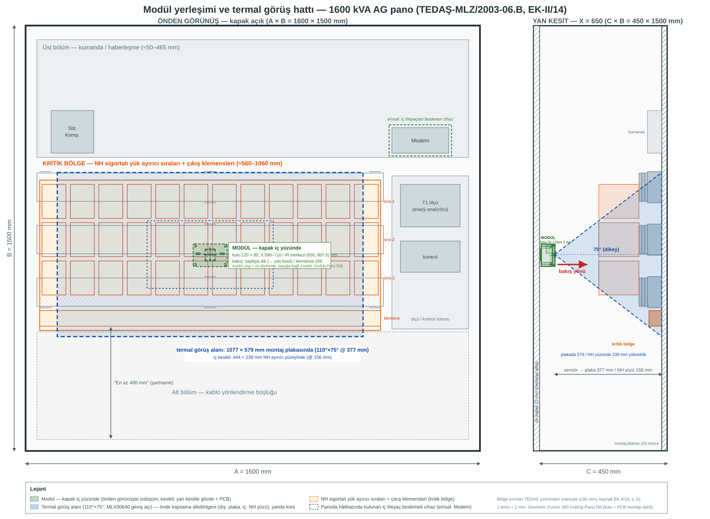
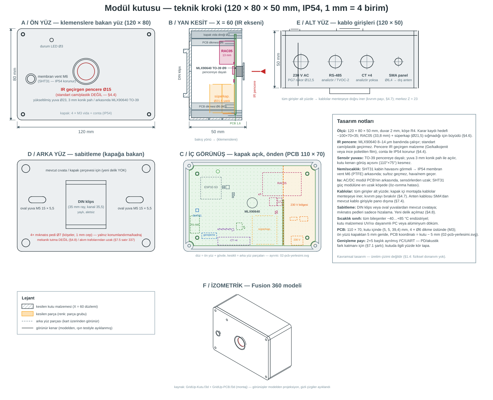

# 4. Mekanik Yerleşim ve Görüş Hattı

**Teslimat karşılığı:** T1 (modül tasarımı), T2 (fiziksel yapı)
**Dayandığı kararlar:** §7.5 (kutu, konum, sabitleme) · §7.1 (kapsama hesabı)
**Bağlayıcı şartlar:** Sabitleme metni (§7.5 satır 331) · Kızılötesi pencere (§7.5 satır 323) · Mıknatıs/CT uyarısı (§7.5 satır 337)

---

## 4.1 Yerleşim krokisi

Karar kaydı satır 627 bu işi tarif ederken *"sıfırdan çizim gerekmez"* diyor: mevcut TEDAŞ çiziminin
üzerine modülün konumu ve sensörün görüş konisi işaretlenir. Aşağıdaki kroki bu yaklaşımla
üretilmiştir — temel alınan çizim: **TEDAŞ-MLZ/2003-06.B, EK-II/14**
(*"1250–1600 kVA dahili tip AG pano boyutları ve cihazların yerleşim resimleri"*).

*(SVG repoda versiyonlanır ve ölçeklenebilir; 1 birim = 1 mm. Sol panel önden görünüş, sağ panel yan
kesit. Görüş konisi yalnızca yan kesitte çizilidir — modül kapak içinden panonun **derinliğine** doğru
bakar, önden görünüşte bu bakış bir dikdörtgen kapsama alanı olarak görünür.)*

---

## 4.2 Referans panonun gerçek ölçüleri (çizimden doğrulanmış)

| Ölçü | Değer | Tolerans |
|---|---|---|
| **A — Genişlik** | 1600 mm | +100 / −0 |
| **B — Yükseklik** | 1500 mm | +50 / −0 |
| **C — Derinlik** | 450 mm | +50 / −0 |

**Çizimden çıkan iç yerleşim (dikey, üstten):**

| Bölge | Yaklaşık konum | İçerik |
|---|---|---|
| Üst bölüm | ≈50–465 mm | Kumanda ve haberleşme: `Sbt. Komp.`, `Modem` kutusu, kontrol modülleri |
| **Orta bölüm** | **≈560–1060 mm** | **3 sıra NH sigortalı yük ayırıcı + altta çıkış klemens sırası (KRİTİK BÖLGE)** — genişlikte ≈50–1250 mm; sağdaki ≈300 mm sütun ölçü/kontrol cihazları (T1) |
| Alt bölüm | ≈1060–1500 mm | Kablo yönlendirme; çizimde *"En az 400 mm"* boşluk şartı |

**Önemli emsal:** Çizimde **`Modem` kutusu** panonun üst bölümünde, iç ihtiyaç devresinden
beslenen bir haberleşme cihazı olarak **hâlihazırda yer alır**. Şartname de panoda modem
kullanılabileceğini belirtir. Bu, bizim modülümüz için **mevcut ve kabul görmüş bir emsaldir** —
jüriye *"panoya neden bir elektronik cihaz ekliyorsunuz"* sorusunun cevabı budur.

---

## 4.3 Termal görüş alanı hesabı

Hesap varsayımla değil, **Fusion 360 modelinden ölçülen gerçek derinliklerle** yapılıyor
(`GridUp-Pano.f3d`). Kutu 50 mm + klips 5 mm olduğundan sensör yüzeyi kapak iç yüzünden 53 mm
içeridedir; hedef düzleme göre **iki farklı mesafe** vardır:

| Düzlem | Sensör → hedef | Kapsama (110° × 75°) | Piksel başına |
|---|---|---|---|
| **Montaj plakası** | **377 mm** | **1077 × 579 mm** | 33,7 × 24,1 mm |
| **NH ayırıcı ön yüzü** | **155,5 mm** | **444 × 239 mm** | 13,9 × 9,9 mm |

**NH ön yüzü nasıl bulundu (kaynaklı zincir):** NH dikey yük ayırıcı baralara oturur; baralar da
mesnet izolatörleriyle plakadan ayrı durur (şartname §2.2.10.2). Plakadan NH ön yüzüne olan mesafe
şu zincirle çıkar:

| Adım | Değer | Kaynak |
|---|---|---|
| Mesnet izolatörü yüksekliği | **50 mm** | Socomec "Busbar Supports" katalogu — L: 33/40/45/50/60/65/70 mm; UL polyester standoff 40–71 mm |
| Bara grubu (2 × 100×10 + 10 mm ara parça) | **30 mm** | Şartname EK-I/8 Tablo 8: 1600 kVA → 2×(100×10) mm² |
| Plakadan bara ön yüzüne (**s**) | **80 mm** | 50 + 30 |
| NH ayırıcı derinliği | **141,5 mm** | Eaton EBV 00 datasheet, Pub. 10275 s.5 |
| **Plakadan NH ön yüzüne** | **221,5 mm** | 80 + 141,5 |

Plaka ön yüzü Z = −430 mm olduğundan NH ön yüzü **Z = −208,5 mm**'dir. Sensör yüzeyi Z ≈ −53 mm
olduğundan sensör → NH **155,5 mm** çıkar.

> **İzolatör yüksekliği bir SEÇİMDİR.** Şartname bara standoff'unu milimetrik olarak vermez
> (§2.2.10.2 yalnız "mesnet izolatörleri" der ve TS EN 60269-1'e atıf yapar; TEDAŞ EK-II/14 çizimi
> dış karkas siluetinden ibarettir). **50 mm** seçildi: Socomec katalogu 33–70 mm aralığının ve
> UL standoff 40–71 mm aralığının ortası; 2×(100×10) mm²'lik ağır bara grubunu taşımak için de
> savunulabilir bir değer. Duyarlılık — farklı seçim kapsamayı doğrudan değiştirir:

| İzolatör | Sensör → NH | Kapsama | Kritik bant | Tam kapsama |
|---|---|---|---|---|
| 40 mm | 165,5 mm | 473 × 254 mm | %39 / %51 | 6 modül |
| **50 mm (seçilen)** | **155,5 mm** | **444 × 239 mm** | **%37 / %48** | **9 modül** |
| 60 mm | 145,5 mm | 416 × 223 mm | %35 / %45 | 9 modül |

> Aralığın tamamında kapsama ±%4 bandında kalır; modül sayısı yalnızca yuvarlama eşiğinde
> (6 ↔ 9) değişir. Bu yüzden seçim bir sonuç iyileştirme değil, gerçekçi bir mühendislik
> tercihidir.

**Doğrulama:** Karar kaydı §7.1 satır 232 *"kapak içine konan sensör hedefe ~40 cm mesafededir;
geniş açılı versiyon bu mesafeden kabaca 114 × 61 cm görür"* diyor. 40 cm'de kapsama **1143 × 614 mm**
olur — yani kaydın kendi hesabı 400 mm varsayımıyla tutarlıdır. Gerçek modelde plaka mesafesi
**377 mm** olduğundan kapsama **1077 × 579 mm**'ye iner; NH gibi öne çıkan yüzeylerde ise çok daha
dardır. Bu bir karar kaydı değişikliği değildir: kayıt mesafeyi *"~40 cm"* diye yaklaşık vermişti,
model kesin ölçüyü verdi. **Parça seçimi (110°×75°) değişmez** — dar açılı varyant (55°×35°)
377 mm'de yalnızca 393 × 238 mm görür ve klemens sırasını hiç kapsamaz.

**Yakınlaşmanın olumlu tarafı:** mesafe kısaldıkça piksel küçülür, yani tespit kabiliyeti artar.
Klemens adımı ~20–25 mm olduğundan NH düzlemindeki **13,9 × 9,9 mm**'lik piksel her klemensi
kendi pikselinde görür — *"gevşek klemensi nokta bazında yakala"* iddiasının dayanağı budur.
Dar görüş alanı bir **çözünürlük değil, kapsama** sorunudur.

**Kapsamanın klemens bölgesine oturması** (modül merkezi x ≈ 650, y ≈ 807,5 mm):

| Düzlem | Dikey pencere | Kritik bölge (560–1060 mm) | Yatay pencere | Kritik genişlik (50–1250 mm) |
|---|---|---|---|---|
| **Montaj plakası** (377 mm) | 518–1097 mm | ✓ **Tamamen** kapsıyor (+42 / +37 mm pay) | 112–1188 mm | %90 — iki uçta **62 mm** pay |
| **NH ön yüzü** (155,5 mm) | 688–927 mm | ✗ Üstten **128 mm**, alttan **133 mm** eksik | 428–872 mm | %37 — iki uçta 378 mm pay |

| | Değer |
|---|---|
| Pano genişliği | 1600 mm |
| Kritik bölge | ≈1200 × 500 mm (x ≈ 50–1250, y ≈ 560–1060; sağ sütun ölçü/kontrol cihazları dışta) |
| Tek modül kapsama genişliği | plaka düzleminde 1077 mm, NH düzleminde **444 mm** — kritik genişliğin **%90 / %37**'si |
| Sonuç | Modül x ≈ 650 mm'ye hizalanır → plaka düzleminde **112–1188 mm** (%90), NH düzleminde **428–872 mm** (%37). Sağ sütundaki ölçü cihazları kapsama dışıdır — orada izlenecek bağlantı yoktur |

**Kapsama sınırı — dürüst ifade (§7.1 satır 232 + §7.5 satır 339):** Tek modül panonun tamamını
görmez; **hiçbir düzlemde kritik bölgeyi tek başına kaplamaz.** Kritik bölgenin tamamını kaplamak
için gereken modül sayısı:

| Düzlem | Kapsama | Gereken modül |
|---|---|---|
| Montaj plakası (377 mm) | 1077 × 579 mm | **2 modül** (2 kolon × 1 sıra) |
| NH ön yüzü (155,5 mm) | 444 × 239 mm | **9 modül** (3 kolon × 3 sıra) |

Karar kaydı satır 339 *"Pano başına modül sayısı: 1 modül baz senaryo"* der; baz senaryo **tek
modülün en kritik noktaya hizalanmasıdır**, bölgenin tamamının kaplanması değil. Tam kaplama
gereken panolarda modül sayısı hedef düzleme göre 2–9 arasında değişir. **"2 modül yeter" iddiası
ölçümle çürütülmüştür:** NH düzleminde iki modül (merkezler 400 / 1200 mm) arasında **356 mm**
boşluk kalır.

---

## 4.4 ️ Kritik tasarım detayı — kızılötesi pencere

Karar kaydı §7.5 satır 323 bu konuda kesin konuşur:

> *"Normal cam veya plastik kızılötesini geçirmez. Termal sensör kutunun içine konup kapağın
> arkasından baktırılamaz; kutu yüzeyinde kendi yuvasında, dışarı bakar konumda olmalıdır."*

**Teknik açıklama:** Termal sensör 8–14 µm bandında (uzak kızılötesi / LWIR) çalışır. Standart cam
ve **çoğu sert plastik** bu bandı **geçirmez** — sensörün önüne konursa sensör hiçbir şey görmez.

> **İstisna — ince polietilen film LWIR'ı geçirir.** Standart cam ve sert plastikler (PC, PMMA,
> ABS) opaktır; ancak **ince PE/HDPE film** (ör. yiyecek saklama filmi, ~20–50 µm) 8–14 µm bandını
> belirgin biçimde geçirir. Bu, **düşük maliyetli bir alternatiftir** ve germanyum/kalkojenit
> pencerenin tedarik riski/ maliyetine karşı sunulabilir. Sınırı: mekanik dayanım zayıftır, IP54
> için gergin ve contalı bir çerçeveye alınmalı; geçirgenlik %70–85 bandındadır (ölçüm sapması
> kalibrasyonla telafi edilir). **Seçim:** birincil çözüm IR geçirgen pencere (germanium/kalkojenit)
> kalır; PE film, tedarik/maliyet gerekirse uygulanabilir alternatif olarak dokümanda anılır.

**İkinci teknik incelik:** MLX90640'ın TO39 kılıfı **kendi filtresini zaten taşır.** Bu nedenle
kutuda *pencere* değil, **açıklık (aperture)** kavramsal olarak yeterlidir. Ancak burada bir
**gerilim** oluşur:

| Seçenek | Kızılötesi geçirgenliği | IP54 uyumu | Değerlendirme |
|---|---|---|---|
| **Açık delik** | ✓ Tam | ✗ Toz ve su girer | IP54 iddiasını çürütür |
| **Standart cam/plastik** |  Geçirmez | ✓ | **Kullanılamaz** |
| **IR geçirgen pencere** (germanium / kalkojenit) | ✓ | ✓ | ✓ Maliyet artışı; Ge ayrıca tedarik riski taşır |
| **İnce tel elek** | △ Kısmi | △ Kısmi | Ucuz ama ölçümü bozabilir |

**Tasarım kararı (bu doküman):** Sensör, kutunun yüzeyindeki **kendi yuvasında, dışa bakar** halde
konumlandırılır ve önüne **IR geçirgen bir pencere** yerleştirilir. Böylece hem §7.5 satır 323'ün
şartı karşılanır hem IP54 koruması korunur.

> **Jüriye hazır cevap:** *"IP54'ü nasıl koruyorsunuz, açıklık bırakırsanız toz girer"* sorusunun
> cevabı bu bölümdür: pencere standart cam değil, **kızılötesi geçirgen** malzemedir. Bu malzeme
> ve maliyeti BOM'da ayrı kalemdir ([2. doküman §2.2](02-bom.md)).

**Kritik uyarı:** Kutu malzemesi seçilirken sensörün baktığı yüzeyin **IR geçirgen** olduğundan
emin olunmalıdır; kutunun geri kalanı opak olabilir.

---

## 4.5 Kutu

| Özellik | Karar kaydı | Bu dokümanın değerlendirmesi |
|---|---|---|
| Boyut | ~10 × 7 × 3,5 cm mertebesi (§7.5 satır 316) | **120 × 80 × 50 mm** olarak belirlendi — bkz. 4.6 |
| Koruma | IP54 muhafaza (§7.5 satır 317) | ✓ Korunuyor (IR pencere ile) |
| Bileşen sıcaklık aralığı | Endüstriyel, −40…+85 °C (§7.5 satır 318) | ✓ BOM'daki tüm bileşenler uyumlu |
| Termal sensör konumu | Kutunun **yüzeyinde, dışa bakan yuvada** (§7.5 satır 319) | ✓ IR pencere ile |

**Muhafaza gerekçesi (§7.5 satır 317):** Pano zaten IP 2X (dahili tip) veya IP 54 (harici tip)
düzeyindedir; modül için gerekçe **toz ve temas koruması**dır.

> **Şartnameden doğrulanan ayrım:** TEDAŞ şartnamesi §2.2.2'ye göre koruma derecesi **bina içi
> (dahili) IP 2X**, **bina dışı (harici) IP 54**'tür. Modülümüz **IP54** seçilerek her iki kurulum
> tipinde de kullanılabilir hale getirilmiştir — bu, tek bir varyantla hem dahili hem harici
> panolara uyum sağlar.

---

## 4.6 ️ Ölçü uyuşmazlığı — dürüst tespit

Karar kaydı kutu boyutunu **"~10 × 7 × 3,5 cm mertebesi"** olarak veriyor (yaklaşık ifade).
Seçilen bileşenlerle bu ölçü **sığmıyor**:

| Bileşen | En büyük boyutu | Not |
|---|---|---|
| **AC/DC güç modülü** (RAC05-05SK/277) | **31,7 × 26,7 × 21,8 mm** | Datasheet DIMENSION (THT/wired); kutunun 50 mm yüksekliğinde rahat sığar |
| Süperkapasitör (Eaton HV, 2 × 10 F) | **2 × Ø10 × 30 mm** | 2 hücre seri; kutuda yatık konumlandırılır. (Karşılaştırma: Eaton PM 5,0 V/1 F tek modül 16,8 × 8,5 × 21,5 — enerji yetersiz, §2.5) |
| ESP32-S3-WROOM-1U modülü | 18,0 × 19,2 × 3,2 mm | + PCB çevresi |
| I²C/RS-485 pasifleri + klemensler | — | Ek yerleşim alanı |

**Sonuç:** Kutu ölçüsü **120 × 80 × 50 mm** olarak belirlenmiştir — karar kaydının *"~10 × 7 ×
3,5 cm mertebesi"* hedefinin üzerinde, ama kayıt ölçüyü zaten *"mertebesi"* ifadesiyle yaklaşık
vermiş ve satır 339'da *"Pano başına modül sayısı: 1 modül baz senaryo"* diyerek yerleşim esnekliği
bırakmıştır. Nihai ölçü Fusion 360 modelleriyle (`GridUp-Kutu.f3d`, `GridUp-PCB.f3d`) sabitlenmiştir.

### Kutu krokisi (kavramsal)

*(1 mm = 4 birim; 120 × 80 × 50 mm. Kaynak: Fusion 360 modelleri `GridUp-Kutu.f3d` + `GridUp-PCB.f3d`
(montaj `GridUp-Kutu-Montaj.f3d`); görünüşler modelden projeksiyonla üretilmiş, gizli çizgiler ayıklanmış,
kesit X = 60 düzleminden alınmıştır. Altı görünüş: **A** ön yüz — IR pencere yuvası (Ø23 yükseltilmiş,
3 mm konik pah) ve SHT31 membran vent; **B** yan kesit — TO-39 sensörün pencereye dayalı yuvası, PCB,
arkadaki hacimli parçalar (RAC05, süperkapasitör yatık); **C** iç görünüş — kapak açık, PCB 110 × 70 ve
230 V bölgesi, arka yüz parçaları kesikli; **D** arka yüz — DIN klips, oval M5 yuvalar, köşe mıknatıs
pedleri (yalnız hizalama, §4.8); **E** alt yüz — 230 V rakor, RS-485, CT girişi, SMA anten;
**F** izometrik. PCB kutu içinde (5, 5, 39,4) mm; kart üstü konumlar
[02-pcb-yerlesimi.svg](02-pcb-yerlesimi.svg)'de PCB koordinatıyla verilir. Üretim çizimi değildir — §1.4.)*

**Dokümana yazılacak ifade:**
> Kutunun ölçüsü **120 × 80 × 50 mm** olarak belirlenmiştir. Karar kaydındaki "~10 × 7 × 3,5 cm"
> ifadesi tasarım hedefidir; seçilen AC/DC modülün (31,7 × 26,7 × 21,8 mm) ve yedek depo
> hücrelerinin fiziksel boyutları nedeniyle nihai ölçü büyümüştür. Nihai geometri Fusion 360
> modelinde sabitlenmiştir; bu, kavramsal tasarımı değiştirmez.

---

## 4.7 Konum ve montaj yeri

**Kural (§7.5 satır 325):** Modül klemenslere **dik bakmalıdır.**

> *"Yan duvar veya tavan yerleşiminde yüzeye çok eğik açıyla bakılır ve ölçüm bozulur. Geometrik
> olarak doğru yer kapak içi veya ön çerçevedir."*

| Yerleşim | Değerlendirme |
|---|---|
| **Kapak içi / ön çerçeve (seçilen)** | ✓ Klemens sırasına dik bakar |
| Yan duvar | ✗ Eğik açı → ölçüm bozulur |
| Tavan | ✗ Aşırı eğik açı |

**Kapak içi yerleşimin iki kısıtı (§7.5 satır 327):**
1. Kapak açılınca görüş kaybolur — pratikte sorun değil, *"kapak açıksa orada bir insan vardır."*
2. Kablo menteşeden geçer — **menteşe yakınında kıvrım payı bırakılır.**

**Konumlandırma:** Modül, kritik bölgenin merkezine — kapak iç yüzünde **(x, y) ≈ (650, 807,5) mm** —
hizalanır; böylece **1077 × 579 mm**'lik kapsama (montaj plakası düzlemi), ≈560–1060 mm arasındaki
üç sigorta sırasını ve çıkış klemens sırasını genişlik boyunca örter (bkz. kroki, önden görünüş).

---

## 4.8 Sabitleme (birebir metin — §7.5 satır 331–333)

§7.5 bu ifadenin dokümanda **aynen** yer almasını şart koşar:

> Modül, panoya **yeni delik açmadan**, mevcut montaj imkânları kullanılarak sabitlenir (DIN rayı,
> mevcut cıvata delikleri veya kapak çerçevesi). Mıknatıslı taban konumlandırma ve kadraj ayarı
> için kullanılır; mekanik tutma her durumda mevcut bir yapı elemanına dayanır.
>
> **Gerekçe:** pano tip testli bir muhafazadır, gövdeye yeni delik açmak beyan edilen IP sınıfını
> ve iç ark dayanımını etkileyebilir. Ayrıca canlı pano içinde yerinden çıkabilecek bir cisim
> kabul edilemez bir risktir; bu nedenle sadece manyetik tutma tek başına yeterli görülmemiştir.

### Neden salt mıknatıs yeterli değil (§7.5 satır 335)

1. **Kısa devre anında pano fiziksel olarak sarsılır** — tam da sistemin çalışması gereken an
2. **Trafo ve baraların sürekli titreşimi** yıllar içinde mıknatısla duran nesneyi "yürütür"
3. **Panoda çalışan teknisyen çarpabilir**

**Asıl gerekçe ise tasarıma özeldir:** termal sensörün değeri **nişan almasına** bağlıdır. Birkaç
santim kayma veya hafif dönme, izlenen klemens sırasını kadraj dışına çıkarır ve sistem
**sessizce kör olur** — fark edilmesi en zor arıza türü.

### ⚠️ Manyetik alan uyarısı (birebir metin — §7.5 satır 337)

> Güçlü mıknatıs panodaki **akım trafolarının yakınına konmamalıdır** (manyetik alan ölçümü
> etkileyebilir). Kapak içi yerleşimde mesafe zaten mevcuttur.

**Ek not:** Pano ana akım trafosu 2500/5'tir (donanım listesinden). Mıknatısın akım trafolarına
ve baralara olan mesafesi tasarımda korunmalıdır.

---

## 4.9 Görüş hattı bütünlüğü — kontrol listesi

- [ ] Sensör klemens sırasına **dik** bakıyor mu?
- [ ] Sensörün önünde kızılötesini kesen bir eleman (standart cam/plastik/kapak sacı) var mı?
- [ ] Sensör kapsaması düzlem bazında kontrol edildi mi? Plaka düzleminde 579 mm (kritik 500 mm'yi **örter**), NH düzleminde 239 mm (kritik 500 mm'yi **örtmez**)
- [ ] Hedef düzlem doğru seçildi mi — plakadaki klemensler mi (377 mm), NH gibi öne çıkan yüzeydekiler mi (155,5 mm)? NH düzleminde dikeyde **3 sıra** gerekir
- [ ] Kapsama dışında kalan kritik klemens var mı? Varsa tam kaplama gerekli — plaka düzleminde **2**, NH düzleminde **9 modül** (§7.5 satır 339)
- [ ] Kablo menteşe yakınında kıvrım payı bırakılmış mı?
- [ ] Sabitleme yeni delik gerektirmiyor mu (DIN rayı / mevcut cıvata / kapak çerçevesi)?
- [ ] Güçlü mıknatıs akım trafolarından ve baralardan uzak mı?
- [ ] Anten kablosu panodan mevcut kablo girişinden çıkıyor mu?

---

## 4.10 Kapsam dışı

- Kutu üretim yöntemi ve malzeme detayı (döküm/enjeksiyon) — prototip imalatı yok (§1.4)
- DIN rayı ve cıvata tiplerinin kesin seçimi — pano üreticisinin mevcut donanımına bağlı
- Çoklu modül senaryosunun kesin montaj detayı — tam kapsama gerektiren panolarda uygulanır (plaka düzleminde 2, NH düzleminde 9 modül)