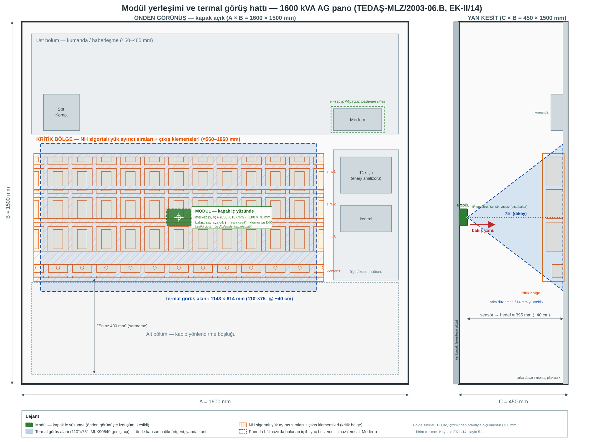

# 4. Mekanik Yerleşim ve Görüş Hattı

**Teslimat karşılığı:** T1 (modül tasarımı), T2 (fiziksel yapı)
**Dayandığı kararlar:** §7.5 (kutu, konum, sabitleme) · §7.1 (kapsama hesabı)
**Bağlayıcı şartlar:** Sabitleme metni (§7.5 satır 331) · Kızılötesi pencere (§7.5 satır 323) · Mıknatıs/CT uyarısı (§7.5 satır 337)

---

## 4.1 Yerleşim krokisi

Karar kaydı satır 627 bu işi tarif ederken *"sıfırdan çizim gerekmez"* diyor: mevcut TEDAŞ çiziminin
üzerine modülün konumu ve sensörün görüş konisi işaretlenir. Aşağıdaki kroki bu yaklaşımla
üretilmiştir — temel alınan çizim: **TEDAŞ-MLZ/2003-06.B, EK-II/14**
(*"1250–1600 kVA dahili tip AG pano boyutları ve cihazların yerleşim resimleri"*).

*(Yukarıdaki SVG repoda versiyonlanır ve ölçeklenebilir; render edilmiş PNG: `yerlesim-overlay.png`)*

---

## 4.2 Referans panonun gerçek ölçüleri (çizimden doğrulanmış)

| Ölçü | Değer | Tolerans |
|---|---|---|
| **A — Genişlik** | 1600 mm | +100 / −0 |
| **B — Yükseklik** | 1500 mm | +50 / −0 |
| **C — Derinlik** | 450 mm | +50 / −0 |

**Çizimden çıkan iç yerleşim (dikey, üstten):**

| Bölge | Yaklaşık konum | İçerik |
|---|---|---|
| Üst bölüm | 0–450 mm | Kumanda ve haberleşme: `Sct. Komp.`, `Modem` kutusu, kontrol modülleri |
| **Orta bölüm** | **≈500–1000 mm** | **Çıkış klemens sıraları — 3–4 yatay sıra (KRİTİK BÖLGE)** |
| Alt bölüm | 1000–1500 mm | Kablo yönlendirme; çizimde *"En az 400 mm"* boşluk şartı |

**Önemli emsal:** Çizimde **`Modem` kutusu** panonun üst bölümünde, iç ihtiyaç devresinden
beslenen bir haberleşme cihazı olarak **hâlihazırda yer alır**. Şartname de panoda modem
kullanılabileceğini belirtir. Bu, bizim modülümüz için **mevcut ve kabul görmüş bir emsaldir** —
jüriye *"panoya neden bir elektronik cihaz ekliyorsunuz"* sorusunun cevabı budur.

---

## 4.3 Termal görüş alanı hesabı (karar kaydı §7.1 ile doğrulanmış)

| Parametre | Değer |
|---|---|
| Sensörün hedefe mesafesi | **~40 cm** (pano derinliği 450 mm; kapak içi yerleşim) |
| Sensör görüş açısı (yatay × dikey) | **110° × 75°** |
| **Kapsama** | **1143 × 614 mm** |
| Piksel başına alan | **~3,6 × 2,5 cm** |

**Doğrulama:** Karar kaydı §7.1 satır 232 *"geniş açılı versiyon bu mesafeden kabaca 114 × 61 cm
görür"* diyor. Hesabımız **114,3 × 61,4 cm** veriyor — **birebir örtüşüyor.** Bu, hem parça
seçiminin (110°×75°) hem de mesafe varsayımının (40 cm) doğruluğunu teyit eder.

**Kapsamanın klemens bölgesine oturması:**

| | Değer |
|---|---|
| Klemens bölgesi yüksekliği | 500 mm (500–1000 mm) |
| Termal kapsama yüksekliği | 614 mm |
| Sonuç | **✓ 614 > 500** — klemens sırası dikeyde **tamamen** kapsanıyor |

| | Değer |
|---|---|
| Pano genişliği | 1600 mm |
| Tek modül kapsama genişliği | 1143 mm (**%71**) |
| Sonuç | Tek modül panonun %71'ini görür; **çıkış klemens sırası** (kritik bölge) kapsanır |

**Kapsama sınırı — dürüst ifade (§7.1 satır 232 + §7.5 satır 339):** Tek sensör panonun tamamını
görmez. En kritik bölge olan **çıkış klemens sırasını** kapsar. Tam pano kapsaması gereken
panolarda **2. modül** eklenir (2 modül merkezleri ~400 mm ve ~1200 mm'ye konumlandığında
panonun tamamı kapsanır).

---

## 4.4 ️ Kritik tasarım detayı — kızılötesi pencere

Karar kaydı §7.5 satır 323 bu konuda kesin konuşur:

> *"Normal cam veya plastik kızılötesini geçirmez. Termal sensör kutunun içine konup kapağın
> arkasından baktırılamaz; kutu yüzeyinde kendi yuvasında, dışarı bakar konumda olmalıdır."*

**Teknik açıklama:** Termal sensör 8–14 µm bandında (uzak kızılötesi / LWIR) çalışır. Standart cam
ve çoğu plastik bu bandı **geçirmez** — sensörün önüne konursa sensör hiçbir şey görmez.

**İkinci teknik incelik:** MLX90640'ın TO39 kılıfı **kendi filtresini zaten taşır.** Bu nedenle
kutuda *pencere* değil, **açıklık (aperture)** kavramsal olarak yeterlidir. Ancak burada bir
**gerilim** oluşur:

| Seçenek | Kızılötesi geçirgenliği | IP54 uyumu | Değerlendirme |
|---|---|---|---|
| **Açık delik** | ✓ Tam | ✗ Toz ve su girer | IP54 iddiasını çürütür |
| **Standart cam/plastik** |  Geçirmez | ✓ | **Kullanılamaz** |
| **IR geçirgen pencere** (germanium / kalkojenit) | ✓ | ✓ | ✓ Maliyet artışı; Ge ayrıca tedarik riski taşır |
| **İnce tel elek** | △ Kısmi | △ Kısmi | Ucuz ama ölçümü bozabilir |

**Tasarım kararı (bu doküman):** Sensör, kutunun yüzeyindeki **kendi yuvasında, dışa bakar** halde
konumlandırılır ve önüne **IR geçirgen bir pencere** yerleştirilir. Böylece hem §7.5 satır 323'ün
şartı karşılanır hem IP54 koruması korunur.

> **Jüriye hazır cevap:** *"IP54'ü nasıl koruyorsunuz, açıklık bırakırsanız toz girer"* sorusunun
> cevabı bu bölümdür: pencere standart cam değil, **kızılötesi geçirgen** malzemedir. Bu malzeme
> ve maliyeti BOM'da ayrı kalemdir ([2. doküman §2.2](02-bom.md)).

**Kritik uyarı:** Kutu malzemesi seçilirken sensörün baktığı yüzeyin **IR geçirgen** olduğundan
emin olunmalıdır; kutunun geri kalanı opak olabilir.

---

## 4.5 Kutu

| Özellik | Karar kaydı | Bu dokümanın değerlendirmesi |
|---|---|---|
| Boyut | ~10 × 7 × 3,5 cm mertebesi (§7.5 satır 316) | ️ **Revize edilmesi gerekiyor — bkz. 4.6** |
| Koruma | IP54 muhafaza (§7.5 satır 317) | ✓ Korunuyor (IR pencere ile) |
| Bileşen sıcaklık aralığı | Endüstriyel, −40…+85 °C (§7.5 satır 318) | ✓ BOM'daki tüm bileşenler uyumlu |
| Termal sensör konumu | Kutunun **yüzeyinde, dışa bakan yuvada** (§7.5 satır 319) | ✓ IR pencere ile |

**Muhafaza gerekçesi (§7.5 satır 317):** Pano zaten IP 2X (dahili tip) veya IP 54 (harici tip)
düzeyindedir; modül için gerekçe **toz ve temas koruması**dır.

> **Şartnameden doğrulanan ayrım:** TEDAŞ şartnamesi §2.2.2'ye göre koruma derecesi **bina içi
> (dahili) IP 2X**, **bina dışı (harici) IP 54**'tür. Modülümüz **IP54** seçilerek her iki kurulum
> tipinde de kullanılabilir hale getirilmiştir — bu, tek bir varyantla hem dahili hem harici
> panolara uyum sağlar.

---

## 4.6 ️ Ölçü uyuşmazlığı — dürüst tespit

Karar kaydı kutu boyutunu **"~10 × 7 × 3,5 cm mertebesi"** olarak veriyor (yaklaşık ifade).
Seçilen bileşenlerle bu ölçü **sığmıyor**:

| Bileşen | En büyük boyutu | Not |
|---|---|---|
| **AC/DC güç modülü** (RAC05-05SK/277) | **~33,8 mm uzunluk** | Serinin DIP modül ölçüsü; tek başına kutunun yüksekliğinin (35 mm) neredeyse tamamı |
| Süperkapasitör (Eaton PM/HV sınıfı) | **~Ø21,5 mm** | Çap olarak kutunun 35 mm'sine zor sığar |
| ESP32-S3-WROOM-1U modülü | ~18 × 19,2 mm | + PCB çevresi |
| I²C/RS-485 pasifleri + klemensler | — | Ek yerleşim alanı |

**Sonuç:** Kutu ölçüsünün **~12 × 8 × 5 cm** mertebesine çıkması beklenmektedir. Bu bir
**karar kaydı değişikliği değildir** — kayıt ölçüyü zaten *"mertebesi"* ifadesiyle yaklaşık
vermiş ve satır 339'da *"Pano başına modül sayısı: 1 modül baz senaryo"* diyerek yerleşim
esnekliği bırakmıştır.

**Dokümana yazılacak ifade:**
> Kutunun nihai ölçüsü, bileşen yerleşimi kesinleştirildiğinde ~12 × 8 × 5 cm mertebesinde
> belirlenecektir. Karar kaydındaki "~10 × 7 × 3,5 cm" ifadesi tasarım hedefidir; seçilen AC/DC
> modülün (33,8 mm) ve süperkapasitörün (Ø21,5 mm) fiziksel boyutları nedeniyle nihai ölçü
> büyümektedir. Bu, kavramsal tasarımı değiştirmez.

---

## 4.7 Konum ve montaj yeri

**Kural (§7.5 satır 325):** Modül klemenslere **dik bakmalıdır.**

> *"Yan duvar veya tavan yerleşiminde yüzeye çok eğik açıyla bakılır ve ölçüm bozulur. Geometrik
> olarak doğru yer kapak içi veya ön çerçevedir."*

| Yerleşim | Değerlendirme |
|---|---|
| **Kapak içi / ön çerçeve (seçilen)** | ✓ Klemens sırasına dik bakar |
| Yan duvar | ✗ Eğik açı → ölçüm bozulur |
| Tavan | ✗ Aşırı eğik açı |

**Kapak içi yerleşimin iki kısıtı (§7.5 satır 327):**
1. Kapak açılınca görüş kaybolur — pratikte sorun değil, *"kapak açıksa orada bir insan vardır."*
2. Kablo menteşeden geçer — **menteşe yakınında kıvrım payı bırakılır.**

**Konumlandırma:** Modül, klemens sırasının dikey merkezine (üstten ~750 mm) hizalanır, böylece
614 mm'lik dikey kapsama 500–1000 mm arasındaki klemens bölgesini tamamen örter.

---

## 4.8 Sabitleme (birebir metin — §7.5 satır 331–333)

§7.5 bu ifadenin dokümanda **aynen** yer almasını şart koşar:

> Modül, panoya **yeni delik açmadan**, mevcut montaj imkânları kullanılarak sabitlenir (DIN rayı,
> mevcut cıvata delikleri veya kapak çerçevesi). Mıknatıslı taban konumlandırma ve kadraj ayarı
> için kullanılır; mekanik tutma her durumda mevcut bir yapı elemanına dayanır.
>
> **Gerekçe:** pano tip testli bir muhafazadır, gövdeye yeni delik açmak beyan edilen IP sınıfını
> ve iç ark dayanımını etkileyebilir. Ayrıca canlı pano içinde yerinden çıkabilecek bir cisim
> kabul edilemez bir risktir; bu nedenle sadece manyetik tutma tek başına yeterli görülmemiştir.

### Neden salt mıknatıs yeterli değil (§7.5 satır 335)

1. **Kısa devre anında pano fiziksel olarak sarsılır** — tam da sistemin çalışması gereken an
2. **Trafo ve baraların sürekli titreşimi** yıllar içinde mıknatısla duran nesneyi "yürütür"
3. **Panoda çalışan teknisyen çarpabilir**

**Asıl gerekçe ise tasarıma özeldir:** termal sensörün değeri **nişan almasına** bağlıdır. Birkaç
santim kayma veya hafif dönme, izlenen klemens sırasını kadraj dışına çıkarır ve sistem
**sessizce kör olur** — fark edilmesi en zor arıza türü.

### ⚠️ Manyetik alan uyarısı (birebir metin — §7.5 satır 337)

> Güçlü mıknatıs panodaki **akım trafolarının yakınına konmamalıdır** (manyetik alan ölçümü
> etkileyebilir). Kapak içi yerleşimde mesafe zaten mevcuttur.

**Ek not:** Pano ana akım trafosu 2500/5'tir (donanım listesinden). Mıknatısın akım trafolarına
ve baralara olan mesafesi tasarımda korunmalıdır.

---

## 4.9 Görüş hattı bütünlüğü — kontrol listesi

- [ ] Sensör klemens sırasına **dik** bakıyor mu?
- [ ] Sensörün önünde kızılötesini kesen bir eleman (standart cam/plastik/kapak sacı) var mı?
- [ ] Sensör kapsaması (614 mm) klemens bölgesini (500 mm) tamamen örtüyor mu?
- [ ] Kapsama dışında kalan kritik klemens var mı? Varsa **2. modül** gerekli (§7.5 satır 339)
- [ ] Kablo menteşe yakınında kıvrım payı bırakılmış mı?
- [ ] Sabitleme yeni delik gerektirmiyor mu (DIN rayı / mevcut cıvata / kapak çerçevesi)?
- [ ] Güçlü mıknatıs akım trafolarından ve baralardan uzak mı?
- [ ] Anten kablosu panodan mevcut kablo girişinden çıkıyor mu?

---

## 4.10 Kapsam dışı

- Kutu üretim yöntemi ve malzeme detayı (döküm/enjeksiyon) — prototip imalatı yok (§1.4)
- DIN rayı ve cıvata tiplerinin kesin seçimi — pano üreticisinin mevcut donanımına bağlı
- 2. modül senaryosunun kesin montaj detayı — tam kapsama gerektiren panolarda uygulanır