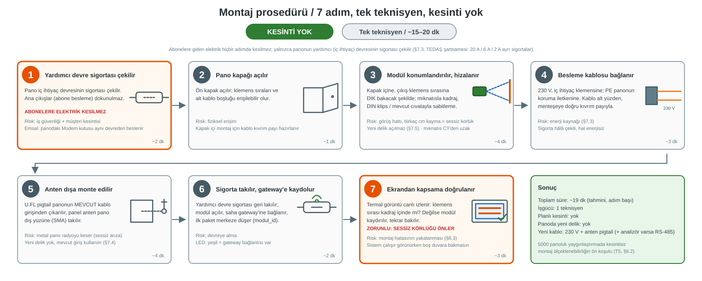

# 6. Montaj Prosedürü

**Teslimat karşılığı:** T1 · **Değerlendirme kriteri 3** ("saha koşullarında uygulanabilirlik")
**Dayandığı kararlar:** §7.5 satır 341–351 (birebir 7 adım)
**Bağlayıcı şart:** Yedi adım, **kesinti yok** gerekçesi, tek teknisyen **~15–20 dakika**

---

## 6.0 Adım akışı

*(Adım 1 ve 7 vurgulu: 1 = abonelere elektrik kesilmez, 7 = sessiz körlüğü önleyen zorunlu doğrulama.
Adım süreleri tahminidir; toplam ~15–20 dk.)*

---

## 6.1 Prosedür (karar kaydı satır 343–349, birebir)

§7.5 montaj prosedürünü yedi adım olarak sabitlemiştir. Aşağıda her adım, **sahada ne anlama
geldiği** ve **hangi riskin karşılandığı** ile birlikte verilmiştir.

| # | Adım | Sahada ne yapılır | Karşılanan risk |
|---|---|---|---|
| **1** | **Yardımcı devre sigortası çekilir** | Pano iç ihtiyaç devresinin sigortası çekilir. **Abonelere giden elektrik kesilmez.** | İş güvenliği + müşteri kesintisi önlenir |
| **2** | **Pano kapağı açılır** | Ön kapak açılır; iç klemens sıraları ve kablo yönlendirme alanı erişilebilir hale gelir | Fiziksel erişim |
| **3** | **Modül konumlandırılır, klemens sırasına hizalanır** | Modül, termal sensör klemenslere **dik bakacak** şekilde konumlandırılır; kadraj ayarı yapılır | Görüş hattı bütünlüğü (sessiz körlük) |
| **4** | **Besleme kablosu iç ihtiyaç klemensine bağlanır** | 230 V besleme, iç ihtiyaç devresinin klemensine bağlanır | Enerji kaynağı (§7.3) |
| **5** | **Anten kablosu mevcut kablo giriş noktasından dışarı çıkarılır, anten dışa monte edilir** | U.FL pigtail panonun mevcut kablo girişinden geçirilir; panel anteni **dışa** monte edilir | Metal pano radyo kesintisi (sessiz arıza) |
| **6** | **Sigorta takılır, modül gateway'e kaydolur** | Yardımcı devre sigortası geri takılır; modül önyüklenip saha gateway'ine bağlanır | Devreye alma |
| **7** | **Ekrandan kapsama doğrulanır** | Termal kadraj ekrandan kontrol edilir: klemens sırası görüş alanında mı? | **Montaj hatasının yakalanması** |

**Süre ve işgücü (satır 351, birebir):**
> **Tek teknisyen, ~15–20 dakika, kesinti yok.**

---

## 6.2 Neden kesintisiz — bu tasarımın ayırt edici iddiası

**Adım 1'in kritik yanı:** Yalnızca **yardımcı devrenin** sigortası çekilir. Abonelere giden
elektrik **kesilmez** (§7.3 satır 273).

**Şartname dayanağı:** TEDAŞ şartnamesinde panoda **üç ayrı yardımcı devre** tanımlıdır ve her
birinin **kendi sigortası** vardır (§7.3 satır 271):

| Yardımcı devre | Anma akımı | İşletme sınıfı |
|---|---|---|
| T.M. iç ihtiyaç devresi | 20 A | gG |
| İç ihtiyaç devresi | 6 A | gG |
| Ölçü devresi | 2 A | gG |

**Emsal — bu zaten yapılan bir şey:** Şartname panoda **modem kullanılabileceğini** belirtir ve
teknik çizimde **`Modem` kutusu** görünür (§2.2 not + EK-II/14 çizimi). Yani **iç ihtiyaç
devresinden beslenen bir haberleşme cihazı için mevcut ve kabul görmüş bir emsal vardır**
(§7.3 satır 271). Bu, jüriye verilecek en güçlü saha uygulanabilirliği cevabıdır.

**Neden bu kadar önemli:** Kesinti gerektiren bir kurulum, 5000 panoluk yaygınlaştırmada
savunulamaz — her panoyu ziyaret etmek ve müşteriyi kesmek gerekir. **Kesintisiz montaj**, projenin
ölçeklenebilirlik iddiasının (**T5**) ön koşuludur.

---

## 6.3 Adım 7 neden zorunlu — "sessiz körlük" riski

Adım 7, "iyi olur" değil **zorunlu** bir adımdır. Gerekçe §7.5 satır 335'te:

> *"termal sensörün değeri **nişan almasına** bağlıdır. Birkaç santim kayma veya hafif dönme,
> izlenen klemens sırasını kadraj dışına çıkarır ve sistem **sessizce kör olur** — fark edilmesi
> en zor arıza türü."*

**Bu neden en tehlikeli arıza türü:** Sistem çalışıyor görünür — veri akar, paketler gelir, arayüz
yeşil. Ama termal dizi artık klemenslere değil, panonun boş bir duvarına bakıyordur. Sonuç:
en önemli ölçüm kanalı **sessizce ölür** ve kimse fark etmez.

**Doğrulama yöntemi (Adım 7):** Montaj sırasında ekrandan termal görüntü canlı izlenir ve
klemens sırasının kapsama alanı içinde olduğu **teyit edilir**. Kapsama dışındaysa modül kaydırılır.

> **Not:** Bu, sistemin genel "sessizce ölmeme" felsefesiyle aynı çizgidedir — §7.6 senaryo 6
> (`sensor_arizasi`) ve senaryo 7 (`modul_saglik`) de aynı ilkeyi taşır: *sistemimiz sessizce
> ölmez* diyebilmek.

---

## 6.4 Montaj öncesi kontrol listesi

- [ ] Doğru yardımcı devre sigortası tespit edildi mi (20 A / 6 A / 2 A — hangisi kullanılacak)?
- [ ] Abonelere giden besleme çıkışlarının kesilmeyeceği teyit edildi mi?
- [ ] Modül konumu klemens sırasına **dik** olacak şekilde belirlendi mi?
- [ ] Güçlü mıknatıs akım trafolarından uzak mı (§7.5 satır 337)?
- [ ] Anten kablosu için **menteşe yakınında kıvrım payı** planlandı mı?
- [ ] Sabitleme **yeni delik açmadan** yapılabiliyor mu (DIN rayı / mevcut cıvata / kapak çerçevesi)?

## 6.5 Montaj sonrası kontrol listesi

- [ ] Modül saha gateway'ine kaydoldu mu (Adım 6)?
- [ ] **Termal kadraj doğrulandı mı** — klemens sırası görüş alanında mı (Adım 7)?
- [ ] Ortam sıcaklık/nem ölçümleri geliyor mu?
- [ ] Akım kanalı veri üretiyor mu (analizör Modbus veya CT)?
- [ ] `modul_durum` alanları anlamlı mı (`besleme: sebeke`, `sinyal` makul dBm aralığında)?
- [ ] Anten dışa monte edildi ve sinyal gücü yeterli mi?
- [ ] Kapak kapatıldığında kablolar sıkışmıyor mu?

---

## 6.6 Kapsam dışı

- Panonun enerjisiz bırakılması gerektiren işler — bu prosedür **kesintisiz** çalışır
- Yüksekte çalışma / iskele gerektiren özel kurulum — referans pano zemin tipidir
- Saha gateway'i kurulumu — İZ C kapsamı (§7.4)