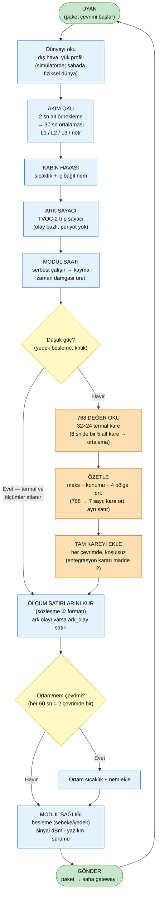

# 7. Modül Yazılım Akış Diyagramı

**Teslimat karşılığı:** T3 (yazılım mimarisi — modül kısmı)
**Dayandığı kararlar:** §7.2 örnekleme sıklığı · §7.4 veri politikası
**Yöntem:** Bu diyagram **uydurulmamıştır** — `/modul-sim/modul_sim/modul.py` içindeki gerçek
firmware akışından türetilmiştir. Kod tarafı PR #1 ile teslim edilmiş, entegrasyon kararıyla
(17 Eyl, commit `3b83483`) güncellenmiştir.

> **Politika notu (entegrasyon kararı, 17 Eyl 2026, madde 2):** Karar kaydı §7.4'teki *"normalde
> özet, anomali anında tam kare"* politikası entegrasyonda değiştirildi: **tam kare her paketle
> gider**, paket ve termal çevrimi **30 sn**'ye hizalandı, modül içi eşik kapısı kaldırıldı.
> Gerekçe ve etkisi §7.3'te. Karar kaydı §7.2 / §7.4 henüz bu karara göre güncellenmedi (lider).

---

## 7.1 Ana akış

> **Okuma notu:** Terimler karar kaydı Türkçesiyle hizalıdır — *uyan → oku → özetle → gönder*
> (§7 doküman çıktıları satır 630'daki *"eşik kontrol"* adımı entegrasyon kararıyla düştü, §7.3).

---

## 7.2 Örnekleme takvimi (§7.2, koddan doğrulanmış)

| Ölçüm | Karar kaydı §7.2 | Koddaki değer | Kaynak |
|---|---|---|---|
| Paket | — | `paket_s=30` | `OrneklemeAyar` |
| Akım | 1–5 sn okunur, 10 sn ort. kaydedilir | `akim_okuma_s=2` alt örnek, **30 sn** ort. (paket penceresi) | `OrneklemeAyar`, `modul.py` adım 3 |
| Termal özet | 10–30 sn | `termal_s=30`; sensör `termal_okuma_s=6` sn'de bir okunur, 5 alt kare ortalanır | `OrneklemeAyar`, adım 7 |
| Termal tam kare | Sadece anomali anında | **Her pakette** (entegrasyon kararı madde 2) | `modul.py` adım 7 |
| Ortam sıcaklık / nem | 30–60 sn | `cevre_s=60` (2 çevrimde bir) | `OrneklemeAyar` |
| Ark | Olay bazlı, örnekleme yok | `ark_tetik` olayı | `modul.py` adım 5 |

**Paket temposu neden 30 sn:** Paket periyodu **akım ortalama penceresidir**: akım 2 sn'de bir
okunur, 15 alt örneğin ortalaması kaydedilir; paket başına bir kayıt, **hiçbir veri atılmaz.**
Termal çevrim paketle aynı süreye hizalandı ki her pakette özet + kare birlikte gitsin ve
merkezdeki dedektör (İZ B, 30 sn tarama) her taramada yeni bir kare bulsun. Karar kaydı §7.2'nin
*"10 sn"* ve *"10–30 sn"* değerleri bu hizalamadan önceki değerlerdir.

---

## 7.3 Eşik kontrolü — kaldırıldı (entegrasyon kararı madde 2)

**Eski tasarım (karar kaydı §7.4 satır 298–304):** normalde yalnız özet gider; modül üç bağımsız
tetikle (`maks_c` 65 °C, `delta_c` 14 °C, `kabin_delta_c` 22 °C) + ark geçersiz kılma + 60 sn hız
sınırıyla *"bu çevrimde tam kare eklensin mi"* kararını verir. Bu, §7.4 satır 304'ün *"modülün
anomaliyi kendi başına tanıyabilmesi"* şartının karşılığıydı.

**Bugünkü durum (kod):** `modul.py` adım 7 kareyi **her çevrimde koşulsuz** ekler; eşik fonksiyonu
(`_kare_gerekli`) koddan çıkarıldı. `EsikAyar` yapılandırma nesnesi **duruyor ama değerlendirilmiyor**:
politika geri istenirse tek noktadan takılsın diye ve merkezden modüle ayar gönderme kavramının
(§7.4 satır 304, T5) yeri belli olsun diye korunmuştur.

**Neden değişti (repodaki kayıt):** Anomali motoru her olaya *olayın anındaki* kareyi kanıt
olarak bağlar (`kanit.kare_id`: değerlendirme anından önceki en yeni kare; `analiz/README`
"Evidence frame at the event's time (10)" ve "(11)"). Modül kendi eşiğiyle kare seçerken, merkezin
başka kanaldan (akım, faz dengesizliği, nem) açtığı olayın anında kare olmayabiliyordu. Kare her
30 sn geldiğinde bu boşluk kalmaz. Entegrasyon belgesinin kendisi repoda değil; karar commit
`3b83483` ve `toplama/migrations/004` başlığında kayıtlı.

**Maliyeti:** kare başına 768 × int16 = **1 536 B** (DB'de, `toplama/migrations/004`; JSONB olarak
tutulsaydı 100 modülde ~430 MB/gün olacağı için ikili biçime geçildi); tel üzerinde JSON ≈ 3–4 KB.
100 modül × 30 sn → **≈ 5 KB/sn** DB yazımı, ≈ 12 KB/sn HTTP. On-prem sunucu ve saha gateway'i için
önemsiz; §7.4 satır 302'deki *"bant genişliğini düşük tutar"* gerekçesi bu ölçekte belirleyici
değildir. Modül tarafında ek yük yok: kare zaten her çevrim okunuyordu.

**Modül hâlâ ne yapar:** 768 değeri yuvarlayıp özetler (maks, konum, 4 bölge ortalaması) ve
kareyle birlikte paketler. Özet, dedektörün ucuz ilk bakışı; kare, kanıt. İkisi de her pakette.
---

## 7.4 ⚠️ Kritik mimari sınır — modül hüküm VERMEZ

Bu, dokümanın en önemli ayrımıdır ve karıştırılırsa sistem yanlış anlatılmış olur:

| Karar | Kim verir | Nerede |
|---|---|---|
| *"Kaç derece?"* | Sensör | Pano içi |
| *"768'den özet çıkar, kareyle birlikte paketle"* | **ESP32** | Pano içi |
| **"Bu bir anomali mi? Hangi tip? Hangi seviye?"** | **Anomali motoru** | **On-prem sunucu** |
| *"Alarm gönderilsin mi, kime?"* | Alarm servisi | On-prem sunucu |

**Modülün ürettiği pakette `seviye` ve `tip` alanları YOKTUR.** Bu alanlar anomali motorunun
çıktısıdır (sözleşme ③). Modül yalnızca *"şüpheli bir şey var, kanıtı da gönderiyorum"* der.

**Tespit tek katmanda, merkezde.** Karar kaydı §7.4 satır 304 *"modülde basit eşik mantığı,
merkezde asıl dedektör"* diyordu; entegrasyon kararıyla modül tarafındaki eşik kalktı (§7.3),
asıl dedektör zaten merkezdeydi. Modül hiçbir hüküm vermez, kanıtı (kare) her pakette gönderir.

**Merkezden modüle ayar:** 100 sahayı gezmemek için gerekli olan bu kanal (§7.4 satır 304, T5)
kodda `OrneklemeAyar` / `EsikAyar` yapılandırma nesneleriyle temsil edilir; protokolü sözleşme
kapsamı dışındadır (§7.9).

---

## 7.5 Veri politikası — özet vs tam kare

| Durum | Gönderilen | Boyut |
|---|---|---|
| **Her paket (30 sn)** | `termal_ozet` (maks + konum (2) + 4 bölge ort. = 7 sayı) **+** `termal_kare` (768 değer) | JSON ≈ 3–4 KB; DB 1 536 B (int16, 0,1 °C) |
| **Düşük güç** (`dusuk_guc`) | Yalnız `modul_durum` (+ varsa `ark_olay`) | < 200 B |

**Eski gerekçe (§7.4 satır 302)** *"özet + olay bazlı tam kare bant genişliğini düşük tutar"*
entegrasyon kararıyla terk edildi; sayısal karşılığı §7.3'te (100 modül ≈ 5 KB/sn). *"Edge'de
işlem"* iddiasının bugünkü karşılığı **özet çıkarma + düşük güç modu**dur, kare seçimi değil.

**Özetin içeriği (sözleşme ② ile birebir):**

| Alan | İçerik |
|---|---|
| `maks` | Karenin en sıcak pikseli (°C) |
| `maks_konum` | `[sütun, satır]` — örn. `[14, 9]` |
| `bolge_ort` | 4 × 16×12 çeyrek bölgenin ortalaması: sol-üst, sağ-üst, sol-alt, sağ-alt |

**Kritik uygulama detayı (koddan):** Özet, **karenin gönderildiği hali üzerinden** hesaplanır —
yuvarlama özetten **önce** yapılır. Sebep: toplayıcı, `maks_konum`'un gerçekten aldığı karenin en
sıcak pikselini işaret ettiğini doğrular. Yuvarlama sırası karışırsa bu kontrol tutmaz.

---

## 7.6 Modül sağlığı — "sessizce ölmeme" kanalı

Her pakette `modul_durum` gönderilir:

| Alan | Değerler | Rolü |
|---|---|---|
| `besleme` | `sebeke` / `yedek` | **`yedek` geçişi = besleme kaybı alarmı.** Süperkapasitörün var olma sebebi budur (§7.3 satır 269) |
| `sinyal` | dBm (negatif) | Zayıflama eğilimi, kararmak üzere olan modül için erken uyarı |
| `yazilim_surumu` | semver | Sürüm takibi |

**Ek davranış (koddan):** Yedek beslemeye geçildiğinde verici **düşük güçte** çalışır ve sinyal
değeri 4 dBm zayıflatılır — enerji tasarrufu. Süperkapasitör kritik seviyeye inince (`dusuk_guc`)
modül termal diziyi ve ölçüm satırlarını **tamamen atlar**; yalnız `modul_durum` (ve varsa ark olayı)
gönderilir — *"termal dizi ile radyo aynı anda karşılanamaz, modül ölmekte olduğunu söyleyen kalp
atışı dışında her şeyi bırakır"* (`senaryo.py`). Diyagramdaki **Düşük güç?** dalı budur.

**Kalite alanı:** Sensör arızası senaryosunda (`sensor_arizasi`) ölçüm değeri ya `null` olur ve
`kalite: yok` işaretlenir, ya da mantıksız bir değer `kalite: supheli` ile işaretlenir. Kural:
**yalnız `kalite: yok` null değer taşıyabilir** — bu kural şemada, veritabanı CHECK kısıtında ve
kodda üç yerde birden uygulanır.

---

## 7.7 Saat davranışı

**Modülün saati serbest çalışır** ve sağlıklıyken bile az miktarda kayar (senaryo 7'nin bir
bileşeni). Toplayıcı bu kaymayı **`alindi_zaman` − `zaman`** farkı olarak görür.

**Sözleşme kuralı (§11):** Modül `zaman` atar, toplayıcı `alindi_zaman` ekler. Zaman biçimi UTC
ISO 8601, **literal `Z`** ile — `+03:00` gibi offset'ler reddedilir. Gerekçe: tek saat dilimi
kullanmak, demoda *"bu yerel saat mi UTC mi"* sorusunu tamamen ortadan kaldırır.

---

## 7.8 Akışın kodla eşleşmesi (doğrulama)

| Diyagram adımı | Kod karşılığı (`modul.py`) |
|---|---|
| Dünyayı oku | adım 1 — `hava.ilerle()`, `Baglam` |
| Senaryo uygula | adım 2 — `senaryo.uygula()` |
| Akım oku (2 sn → 30 sn ort.) | adım 3 — `alt_adim` döngüsü |
| Kabin havası | adım 4 — `_kabin.ilerle()`, `ic_bagil_nem()` |
| Ark sayacı | adım 5 — `ark_tetik` |
| Modül saati | adım 6 — `saat_kayma_ppm` |
| Düşük güç? | `b.dusuk_guc` — adım 7 ve 8'i atlar |
| Termal oku + özetle + kareyi ekle | adım 7 — `dizi.kare()` × 5 alt kare, `TermalDizi.ozet()`, `termal_kare = kare` |
| Ölçüm satırlarını kur | adım 8 |
| Modül sağlığı | adım 9 — `modul_durum` |
| Gönder | `UretilenPaket` döner |

**Doğrulama:** Diyagramdaki dokuz adım, kodun `ilerle()` fonksiyonundaki dokuz numaralı adımla
**birebir** eşleşir. Kod ve doküman arasında çelişki yoktur.

---

## 7.9 Kapsam dışı

| Konu | Nerede |
|---|---|
| Toplama servisi (paket alma, doğrulama, DB yazma) | `/toplama` — İZ A kod tarafı |
| Anomali motoru ve dedektörler | İZ B |
| Seviye/tip kararı, alarm kuralları | İZ B, İZ C |
| Merkezden modüle ayar gönderme protokolü | Tasarım gereği gerekli (§7.4); sözleşme kapsamı dışında, gelecek çalışma |
| Arayüz, Modbus sunucusu | İZ C |