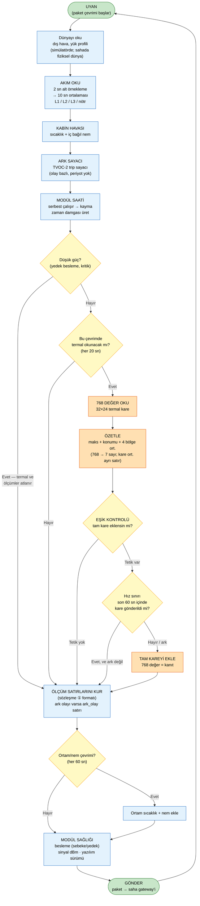

# 7. Modül Yazılım Akış Diyagramı

**Teslimat karşılığı:** T3 (yazılım mimarisi — modül kısmı)
**Dayandığı kararlar:** §7.2 örnekleme sıklığı · §7.4 veri politikası
**Yöntem:** Bu diyagram **uydurulmamıştır** — `/modul-sim/modul_sim/modul.py` içindeki gerçek
firmware akışından türetilmiştir. Kod tarafı PR #1 ile teslim edilmiştir.

---

## 7.1 Ana akış

> **Okuma notu:** Terimler karar kaydı Türkçesiyle hizalıdır — *uyan → oku → özetle → eşik
> kontrolü → gönder* (§7 doküman çıktıları satır 630).

---

## 7.2 Örnekleme takvimi (§7.2, koddan doğrulanmış)

| Ölçüm | Karar kaydı §7.2 | Koddaki değer | Kaynak |
|---|---|---|---|
| Akım | 1–5 sn okunur, 10 sn ort. kaydedilir | `akim_okuma_s=2`, `paket_s=10` | `OrneklemeAyar` |
| Termal özet | 10–30 sn | `termal_s=20` | `OrneklemeAyar` |
| Termal tam kare | Sadece anomali anında | `EsikAyar` tetikleri | `modul.py` |
| Ortam sıcaklık / nem | 30–60 sn | `cevre_s=60` | `OrneklemeAyar` |
| Ark | Olay bazlı, örnekleme yok | `ark_tetik` olayı | `modul.py` |

**Paket temposu neden 10 sn:** Paket periyodu **akım ortalama penceresidir**. Akım 2 sn'de bir
okunur ve 10 sn ortalaması kaydedilir; yani 10 sn'de bir paket = pencere başına bir kayıt ve
**hiçbir veri atılmaz.**

---

## 7.3 Eşik kontrolü — modülün karar noktası

**Üç bağımsız tetik + ark geçersiz kılma + hız sınırı.** Karar kaydı §7.4 satır 304'ün zorunlu
kıldığı "modülün anomaliyi kendi başına tanıması" burada gerçekleşir.

| Tetik | Değer | Neden gerekli (koddan) |
|---|---|---|
| **`maks_c`** | **65,0 °C** | Mutlak sıcak piksel sıcaklığı |
| **`delta_c`** | **14,0 °C** | Sıcak piksel − kare ortalaması. *"55 °C'lik bir nokta 25 °C kabinde arızadır; 50 °C kabinde sıcak bir ağustos öğleden sonrasında tüm kart sıcaktır — ikisini ayıran yalnızca deltadır."* |
| **`kabin_delta_c`** | **22,0 °C** | Sıcak piksel − kabin ortamı. Merkezin hesapladığı akım/sıcaklık korelasyonunun **modül üstündeki ucuz karşılığı** |
| **`ark`** | Her zaman (`ark_kare=True`) | *"Operatörün kesinlikle bakmak isteyeceği tek paket"* |
| **`min_aralik_s`** | **60 sn** | Hız sınırı: *"sürekli arızada olan bir modül, tüm uplink bütçesini 768 değeri tekrar tekrar göndermeye harcamasın"* |

### Neden üç ayrı tetik? (koddaki gerekçe, birebir çeviri)

Tek bir mutlak sıcaklık eşiği **yetmez**, çünkü sıcak nokta her zaman mutlak olarak sıcak değildir:

- **Yaz günü, tüm pano sıcak:** mutlak eşik yanlış alarm verir → `delta_c` bunu ayıklar
- **Kış günü, normal oda, tek klemens ısınmış:** mutlak eşik yakalar → `maks_c`
- **Kabin dışına göre aşırı ısınma:** `kabin_delta_c` bağlamı verir

---

## 7.4 ⚠️ Kritik mimari sınır — modül hüküm VERMEZ

Bu, dokümanın en önemli ayrımıdır ve karıştırılırsa sistem yanlış anlatılmış olur:

| Karar | Kim verir | Nerede |
|---|---|---|
| *"Kaç derece?"* | Sensör | Pano içi |
| *"768'den özet çıkar"* | **ESP32** | Pano içi |
| *"Bu çevrimde tam kare eklensin mi?"* | **ESP32** (üç tetik) | Pano içi |
| **"Bu bir anomali mi? Hangi tip? Hangi seviye?"** | **Anomali motoru** | **On-prem sunucu** |
| *"Alarm gönderilsin mi, kime?"* | Alarm servisi | On-prem sunucu |

**Modülün ürettiği pakette `seviye` ve `tip` alanları YOKTUR.** Bu alanlar anomali motorunun
çıktısıdır (sözleşme ③). Modül yalnızca *"şüpheli bir şey var, kanıtı da gönderiyorum"* der.

**Eşik mantığı = dedektör değil, tetikleyici.** Karar kaydı §7.4 satır 304:
> *"Dolayısıyla tespit iki katmanlıdır: **modülde basit eşik mantığı, merkezde asıl dedektör.**"*

**Bunun ters yönlü sonucu:** eşiği değiştirmek için 100 sahayı gezmek mümkün olmadığından
**merkezden modüle ayar gönderme** ihtiyacı doğar — bu, T5 ölçeklenebilirlik açısından kazançtır
(§7.4 satır 304). Kodda `EsikAyar` bir **yapılandırma nesnesidir**, sabit değil; tıpkı
*"merkezden modüle ayar gönderme"*nin karşılığı olduğu gibi.

---

## 7.5 Veri politikası — özet vs tam kare

| Durum | Gönderilen | Boyut |
|---|---|---|
| **Normal çalışma** | `termal_ozet`: maks + konum + 4 bölge ortalaması | ~3 sayı |
| **Tetik aktif** | `termal_ozet` **+** `termal_kare` (768 değer, kanıt) | ~3 KB |

**Gerekçe (§7.4 satır 302):** *"Özet + olay bazlı tam kare politikası bant genişliğini düşük tutar
ve 'edge'de işlem yapıyoruz' iddiasının somut karşılığıdır."*

**Sayısal karşılığı:** 768 değer ≈ 3 KB. 100 modül bunu her 10 saniyede gönderse iletişim hattı
çöker. Özet politikasıyla normal trafik **~3 sayı** düzeyinde kalır.

**Özetin içeriği (sözleşme ② ile birebir):**

| Alan | İçerik |
|---|---|
| `maks` | Karenin en sıcak pikseli (°C) |
| `maks_konum` | `[sütun, satır]` — örn. `[14, 9]` |
| `bolge_ort` | 4 × 16×12 çeyrek bölgenin ortalaması: sol-üst, sağ-üst, sol-alt, sağ-alt |

**Kritik uygulama detayı (koddan):** Özet, **karenin gönderildiği hali üzerinden** hesaplanır —
yuvarlama özetten **önce** yapılır. Sebep: toplayıcı, `maks_konum`'un gerçekten aldığı karenin en
sıcak pikselini işaret ettiğini doğrular. Yuvarlama sırası karışırsa bu kontrol tutmaz.

---

## 7.6 Modül sağlığı — "sessizce ölmeme" kanalı

Her pakette `modul_durum` gönderilir:

| Alan | Değerler | Rolü |
|---|---|---|
| `besleme` | `sebeke` / `yedek` | **`yedek` geçişi = besleme kaybı alarmı.** Süperkapasitörün var olma sebebi budur (§7.3 satır 269) |
| `sinyal` | dBm (negatif) | Zayıflama eğilimi, kararmak üzere olan modül için erken uyarı |
| `yazilim_surumu` | semver | Sürüm takibi |

**Ek davranış (koddan):** Yedek beslemeye geçildiğinde verici **düşük güçte** çalışır ve sinyal
değeri 4 dBm zayıflatılır — enerji tasarrufu. Süperkapasitör kritik seviyeye inince (`dusuk_guc`)
modül termal diziyi ve ölçüm satırlarını **tamamen atlar**; yalnız `modul_durum` (ve varsa ark olayı)
gönderilir — *"termal dizi ile radyo aynı anda karşılanamaz, modül ölmekte olduğunu söyleyen kalp
atışı dışında her şeyi bırakır"* (`senaryo.py`). Diyagramdaki **Düşük güç?** dalı budur.

**Kalite alanı:** Sensör arızası senaryosunda (`sensor_arizasi`) ölçüm değeri ya `null` olur ve
`kalite: yok` işaretlenir, ya da mantıksız bir değer `kalite: supheli` ile işaretlenir. Kural:
**yalnız `kalite: yok` null değer taşıyabilir** — bu kural şemada, veritabanı CHECK kısıtında ve
kodda üç yerde birden uygulanır.

---

## 7.7 Saat davranışı

**Modülün saati serbest çalışır** ve sağlıklıyken bile az miktarda kayar (senaryo 7'nin bir
bileşeni). Toplayıcı bu kaymayı **`alindi_zaman` − `zaman`** farkı olarak görür.

**Sözleşme kuralı (§11):** Modül `zaman` atar, toplayıcı `alindi_zaman` ekler. Zaman biçimi UTC
ISO 8601, **literal `Z`** ile — `+03:00` gibi offset'ler reddedilir. Gerekçe: tek saat dilimi
kullanmak, demoda *"bu yerel saat mi UTC mi"* sorusunu tamamen ortadan kaldırır.

---

## 7.8 Akışın kodla eşleşmesi (doğrulama)

| Diyagram adımı | Kod karşılığı (`modul.py`) |
|---|---|
| Dünyayı oku | adım 1 — `hava.ilerle()`, `Baglam` |
| Senaryo uygula | adım 2 — `senaryo.uygula()` |
| Akım oku (2 sn → 10 sn ort.) | adım 3 — `alt_adim` döngüsü |
| Kabin havası | adım 4 — `_kabin.ilerle()`, `ic_bagil_nem()` |
| Ark sayacı | adım 5 — `ark_tetik` |
| Modül saati | adım 6 — `saat_kayma_ppm` |
| Düşük güç? | `b.dusuk_guc` — adım 7 ve 8'i atlar |
| Termal oku + özetle | adım 7 — `dizi.kare()`, `TermalDizi.ozet()` |
| Eşik kontrolü | `_kare_gerekli()` |
| Ölçüm satırlarını kur | adım 8 |
| Modül sağlığı | adım 9 — `modul_durum` |
| Gönder | `UretilenPaket` döner |

**Doğrulama:** Diyagramdaki dokuz adım, kodun `ilerle()` fonksiyonundaki dokuz numaralı adımla
**birebir** eşleşir. Kod ve doküman arasında çelişki yoktur.

---

## 7.9 Kapsam dışı

| Konu | Nerede |
|---|---|
| Toplama servisi (paket alma, doğrulama, DB yazma) | `/toplama` — İZ A kod tarafı |
| Anomali motoru ve dedektörler | İZ B |
| Seviye/tip kararı, alarm kuralları | İZ B, İZ C |
| Merkezden modüle ayar gönderme protokolü | Tasarım gereği gerekli (§7.4); sözleşme kapsamı dışında, gelecek çalışma |
| Arayüz, Modbus sunucusu | İZ C |